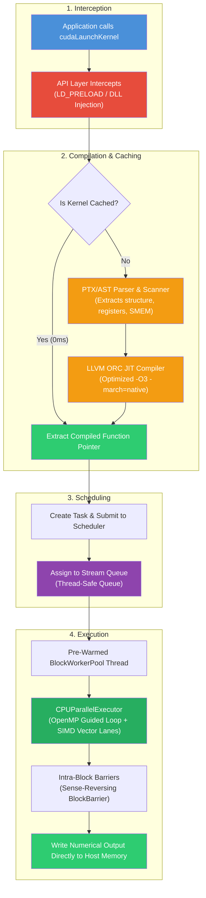
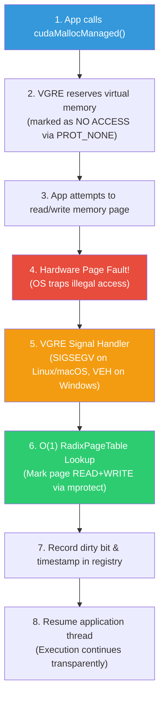

# VGRE Architecture & Design

**Version**: 1.1.0
**Last Updated**: 2026-05-07

---

## System Overview

VGRE (Virtual GPU Runtime Engine) is a CUDA emulation runtime that intercepts GPU API calls and executes them on CPU hardware using LLVM JIT compilation and OpenMP parallelization.

```
┌─────────────────────────────────────────────────────────────────┐
│ Application (PyTorch, TensorFlow, Custom CUDA)                  │
└────────────────────────┬────────────────────────────────────────┘
                         │
                         ▼
┌─────────────────────────────────────────────────────────────────┐
│ API Interception Layer (LD_PRELOAD / DLL Injection)             │
│ - CUDA Runtime API (~94 of ~214 functions, ~45% coverage)       │
│ - OpenCL 1.2 Adapter                                            │
│ - cuBLAS (~13%), cuDNN (~24%), NCCL (~55%) Shims               │
└────────────────────────┬────────────────────────────────────────┘
                         │
                         ▼
┌─────────────────────────────────────────────────────────────────┐
│ Runtime Engine (src/core/runtime_engine.cpp)                    │
│ - Kernel registration & caching                                 │
│ - Stream & event management                                     │
│ - Memory allocation & UVM page fault handling                   │
└────────────────────────┬────────────────────────────────────────┘
                         │
        ┌────────────────┼────────────────┐
        ▼                ▼                ▼
┌──────────────┐  ┌──────────────┐  ┌──────────────┐
│ Kernel       │  │ Memory       │  │ Scheduler    │
│ Compiler     │  │ Manager      │  │              │
│ (LLVM JIT)   │  │ (UVM)        │  │ (Streams)    │
└──────────────┘  └──────────────┘  └──────────────┘
        │                │                │
        └────────────────┼────────────────┘
                         │
                         ▼
┌─────────────────────────────────────────────────────────────────┐
│ CPU Parallel Executor (OpenMP + SIMD)                           │
│ - Block-level parallelization                                   │
│ - Thread-level execution                                        │
│ - SIMD vectorization (AVX2/AVX-512)                             │
└────────────────────────┬────────────────────────────────────────┘
                         │
                         ▼
┌─────────────────────────────────────────────────────────────────┐
│ Host CPU (Multi-core, Multi-socket)                             │
└─────────────────────────────────────────────────────────────────┘
```

---

## Core Components

### 1. API Layer (`src/api/`)

**Purpose**: Intercept CUDA/OpenCL calls and route them to the runtime engine.

**Key Files**:
- `cuda_interceptor.h` - CUDA API interception
- `opencl_adapter.h` - OpenCL 1.2 compatibility
- `vgre_c_api.h` - C API for Python bindings
- `cublas_shim.cpp` - cuBLAS implementation (supporting L1/L2/L3, StridedBatched GEMM, and heuristics)
- `cudnn_shim.cpp` - cuDNN core, pointwise, and attention descriptors
- `cudnn_normalization.cpp` - cuDNN Layer and Batch Normalization (forward/backward)
- `cudnn_rnn.cpp` - cuDNN RNN packed sequence LSTM/GRU and BPTT backward APIs
- `cusparse_core.cpp` - cuSPARSE CSR/BSR format, SpMV, SpMM, and batched SpMM
- `cusparse_triangular.cpp` - cuSPARSE SpSM (Sparse Triangular Solve for real and complex types) and SDDMM (Sampled Dense-Dense GEMM)
- `nccl_shim.cpp` - NCCL collective operations (supporting Ring AllReduce and SHM bypass)

**Interception Methods**:
- **Linux/macOS**: `LD_PRELOAD` environment variable loads `libvgre_cudart.so`
- **Windows**: DLL replacement or PATH manipulation
- **Python**: ctypes bindings to C API

### 2. Runtime Engine (`src/core/runtime_engine.cpp`)

**Purpose**: Central coordinator for kernel execution, memory management, and stream scheduling.

**Key Responsibilities**:
- Kernel registration and caching
- Stream creation and management
- Event synchronization
- Device information reporting
- Graph capture and replay

**Key Data Structures**:
```cpp
struct RuntimeEngine {
    std::map<KernelId, CompiledKernel> kernel_cache_;
    std::map<StreamId, Stream> streams_;
    std::map<EventId, Event> events_;
    MemoryManager memory_manager_;
    Scheduler scheduler_;
    AdaptiveExecutionEngine adaptive_engine_;
};
```

### 3. Kernel Compiler (`src/compiler/`)

**Purpose**: Translate GPU kernels to CPU-executable code via LLVM JIT.

**Pipeline**:
```
CUDA Kernel Source / PTX Input
    ↓
Clang Parser / PTX Scanner (Extract AST & register count via .reg directives)
    ↓
Wrapper Generator (Bridge GPU calling conventions with gridDim, blockDim, sharedMem to C++ function)
    ↓
Clang Compiler (-O3 -march=native -ffast-math)
    ↓
LLVM ORC JIT (Generate high-performance host machine code)
    ↓
Executable Function Pointer (registered in kernelAddressMap_)
```

**Key Files**:
- `clang_kernel_parser.cpp` - Parse CUDA kernel source and build AST representations
- `llvm_translation_engine.cpp` - LLVM IR translation and JIT execution engine
- `kernel_cache.cpp` - Thread-safe LRU JIT cache with checksum verification and cache-eviction guards
- `ptx_translator.cpp` - Inline/standalone PTX translation, featuring `.reg` register-count scanning and hardware fatbinary SASS parsing

**Register & shared Memory Scanner**:
During translation, VGRE performs static analysis on PTX source or LLVM IR, scanning `.reg` register declarations and `__shared__` buffer allocations. This dynamically computes each kernel's static/dynamic shared memory requirements and occupancy bounds (stored in `VgreKernelRegistry`), avoiding fixed hardcoded limits.

**Caching Strategy**:
- **Memory Cache**: Thread-safe LRU hash table (0ms lookup on hit) with lock-free eviction guards.
- **Disk Cache**: Located at `~/.vgre/cache/` (5–10ms lookup on hit) containing compiled shared object binaries with checksum-validated AST structures.
- **Cache Key**: Generated from the SHA-256 hash of the kernel source, target architecture flags, SIMD vector level, and compiler optimization flags.

### 4. Memory Manager (`src/core/memory_manager.cpp`)

**Purpose**: Manage GPU-like memory allocation and Unified Virtual Memory (UVM).

**Memory Types**:
- **Regular Memory** (`cudaMalloc`): Host allocation tracked in sorted `allocRange_` map
- **Managed Memory** (`cudaMallocManaged`): UVM with page-fault handling via `mmap(PROT_NONE)` + signal
- **Async Pools** (`cudaMallocAsync`): Stream-ordered allocation with CUDA pool semantics

**Handle Lookup (O(log n))**:
`isValidHandle`, `getAllocationSize`, and `getPointer` all use binary search on the sorted `allocRange_` map — not a linear scan. This ensures sub-microsecond lookups even with millions of live allocations.

**UVM Implementation**:
```
1. App calls cudaMallocManaged(ptr, size)
2. VGRE allocates via mmap(PROT_NONE) — marks region inaccessible
3. App accesses memory → Page Fault (SIGSEGV on Linux/macOS, VEH on Windows)
4. Signal/VEH handler: O(1) RadixPageTable lookup → mprotect(READ+WRITE) → record in dirty bitmap
5. App continues normally (transparent)
6. Migration thread (every 500 ms or VGRE_UVM_MIGRATION_MS): batch migrates dirty pages to NUMA node 0
```

**Pool Allocator**:
- Two-path design: slab free-list for requests ≤ `blockSize`; direct allocation (tracked in `oversizedAllocs`) for larger requests — matches CUDA stream-ordered pool semantics
- Slabs ≥ 2 MB are NUMA-bound via `mbind(MPOL_PREFERRED, node=0)` on Linux
- `freeToPool` validates pointer provenance (rejects foreign pointers)
- `destroyPool` returns `ERR_BUSY` if outstanding allocations exist
- `liveSlabAllocs` and `slabRanges` track slab membership for O(1) provenance checks

**RadixPageTable**:
- O(1) signal-safe page fault lookup (two-level radix tree: 512 L1 entries × 512 L2 entries)
- Destructor properly frees all L2 tables and L1 array (no leak on teardown)

### 5. Scheduler (`src/core/scheduler.cpp`)

**Purpose**: Manage asynchronous task execution across streams.

**Stream Model**:
- Each CUDA stream has its own task queue
- Tasks are executed serially within a stream
- Multiple streams execute in parallel

**Task Types**:
- Kernel launch
- Memory copy
- Event record
- Synchronization barrier

**Scheduling Algorithm**:
```cpp
for each stream {
    while (task_queue not empty) {
        task = dequeue();
        if (dependencies satisfied) {
            execute(task);
        } else {
            re_enqueue(task);
        }
    }
}
```

**Performance Notes**:
- Zero heap allocation per task dequeue: `WorkItem` is moved off the `std::priority_queue` via `const_cast + move + pop` — no `new WorkItem(...)` on the hot path
- `pending_` decrement uses `fetch_sub(1, std::memory_order_acq_rel)` for correct visibility across threads

### 6. CPU Parallel Executor (`src/runtime/cpu_parallel_executor.cpp`)

**Purpose**: Execute kernels on CPU cores using OpenMP parallelization.

**GPU→CPU Mapping**:
| GPU Concept | CPU Reality |
|---|---|
| Grid (thousands of blocks) | OpenMP parallel loop |
| Block (group of threads) | SIMD vectorization |
| Thread (single worker) | OS thread |
| Shared Memory | Pre-allocated buffer (outside block loop) |

**Execution Model**:
```cpp
// Per-thread local accumulator (cache-line aligned) — no per-block atomics
struct alignas(64) LocalAccum { uint64_t flops; uint64_t bytes; };
std::vector<LocalAccum> tls(omp_get_max_threads(), {0, 0});

auto t0 = std::chrono::steady_clock::now();  // one timer pair for entire grid
#pragma omp parallel for schedule(guided)
for (int block_idx = 0; block_idx < grid_size; block_idx++) {
    execute_block(block_idx);
    tls[omp_get_thread_num()].flops += block_flops;
}
auto t1 = std::chrono::steady_clock::now();

// Single fetch_add after parallel region
uint64_t totalFlops = 0;
for (auto& la : tls) totalFlops += la.flops;
aee.recordRealFlops(totalFlops);
```

**Performance Notes**:
- `schedule(guided)` (no explicit chunk size) lets OpenMP pick decreasing chunk sizes — better load balance with less atomic overhead than `schedule(guided,1)`
- Per-block `chrono::now()` eliminated — a single start/end pair brackets the entire OMP region
- Cache-line-padded `LocalAccum` per OMP thread eliminates false sharing on the accumulator

**Synchronization**:
- `__syncthreads()`: Sense-reversing barrier in BlockWorkerPool
- `this_grid().sync()`: GridBarrierState with atomic counter
- `cudaStreamSynchronize()`: Drain per-stream task queue
- Cooperative launch start-gate: `condition_variable` (all threads wait until all are ready before executing)

### 7. Block Worker Pool (`src/runtime/block_worker_pool.cpp`)

**Purpose**: Pre-warmed thread pool for block-level execution — eliminates per-launch OS thread-create overhead.

**Design**:
- **Initialization**: The pool is initialized at startup with `N = hardware_concurrency()` (typically 1024-2048 pre-warmed threads) waiting on a synchronization queue.
- **Dispatch**: `dispatch(fn)` schedules a task block onto the pre-warmed threads, completely avoiding the 5–50 µs overhead of creating standard OS threads during hot paths.
- **Intra-Block Barrier (`__syncthreads()`)**: Implemented as a lock-free sense-reversing barrier (`BlockBarrier`) shared among all workers within a cooperative block group. Threads toggle their private phase Sense bit and wait on a generation counter, ensuring low-latency synchronization without spinning cycles on CPU resources.
- **Two-Level Dispatch & Oversubscription Guard**: When the block launching requests `threadsPerBlock > pool.getCapacity()`, VGRE automatically triggers an oversubscription safeguard. Instead of launching parallel threads that exceed the host pool's thread limit (which would cause massive OS context-switching overhead and potential thread exhaustion), thread 0 runs the block serially. The sense-reversing barriers (`__syncthreads()`) are dynamically transformed into no-ops to prevent deadlocks. JIT kernels utilize the same pool through `vgre_jit_block_dispatch()`.
- **Cooperative grid Launch**: Employs a thread-safe `condition_variable` start-gate. All worker threads wait until the entire block group reaches the entry boundary before executing, satisfying physical CUDA cooperative grid semantics.

### 8. Adaptive Execution Engine (`src/advanced/adaptive_execution_engine.cpp`)

**Purpose**: Auto-tune thread count and performance predictions.

**Calibration Process**:
1. Run micro-benchmarks once at startup in `runBenchmark()` — stores result in `globalOptimalVectorWidth_` atomic
2. Measure peak GFLOPS and memory bandwidth (64 MB × 50 iterations memcpy)
3. Store results in process-wide cache — subsequent constructions skip the 300 ms benchmark
4. Use for telemetry and performance predictions

**Thread Count Selection**:
UCB1 multi-armed bandit explores all power-of-two thread counts systematically, replacing the prior random 10% exploration. Converges to the optimal count for each kernel's compute/memory ratio.

**Performance Metrics**:
- Kernel execution time (wall-clock)
- Memory bandwidth (GB/s)
- GFLOPS (via `perf_event_open` for real instruction counting on Linux)
- Coalescing efficiency

**Temperature Monitoring** (real on all platforms):
- Linux: `/sys/class/thermal/` thermal zones + `/sys/class/hwmon/` (k10temp, coretemp)
- macOS: IOKit SMC keys `TC0P` → `TC0F` → `Tp09` / `Tp0P` / `Tp19`
- Windows: WMI `MSAcpi_ThermalZoneTemperature` via COM background thread, 5-second TTL cache

### 9. TCP Cluster Manager (`src/advanced/tcp_cluster.cpp`)

**Purpose**: Distribute kernel execution across multiple machines.

**Architecture**:
```
Master Node                    Network (TCP+AES)              Worker Nodes
─────────────                  ──────────────────             ────────────
cudaMalloc(ptr, N)
launchRemoteKernel()
  ├── streamArgumentsToWorker()
  │     └── sendPointerArg() ──────────────────────────────→ Receive data
  └── LAUNCH_KERNEL() ──────────────────────────────────────→ Execute kernel
                                                              ├── cuMemAlloc
                                                              ├── cuMemcpyHtoD
                                                              ├── cuLaunchKernel
                                                              └── cuMemcpyDtoH
                      ←─────────────────────────────────────── Return results
```

**Security**:
- HMAC-SHA256 authentication handshake
- AES-256-CTR encryption for all traffic
- 2048-bit sliding replay bitmap (RFC 4303) prevents reuse across high-bandwidth bursts
- Session key zeroized via `vgre_secure_zero` at destruction and rotation
- `sendAll` uses `poll(POLLOUT)` — no busy-wait
- Hardware-backed token storage (keyring/Keychain/CredMan/TPM)

**CapabilityPacket** (exchanged at connection time):
- `gpu_count`, `gpu_name[128]`, `gpu_memory_bytes`, `gpu_compute_major/minor`, `gpu_sm_count`
- Populated from `GPUPassthrough::instance()` probe

**Discovery**:
- UDP broadcast on local subnet (every 2 seconds)
- Manual node list via `VGRE_CLUSTER_NODES` env var
- Mesh topology support via `VGRE_MESH_PEERS`
- IPv6 dual-stack: all TCP paths via `getaddrinfo(AF_UNSPEC)` with IPv4 fallback

**Workload Partitioning** (3D recursive bisection):
- Capacity computed once per node (not per comparison) via pre-built `caps[]` vector
- Minimum latency floor `std::max(latency_ms, 0.001)` prevents divide-by-near-zero artifacts
- Accuracy factor EWMA (α = 0.25) adjusts future slice sizes based on observed vs predicted execution time

### 10. MPS Multi-Process Server (`src/advanced/mps_control.cpp`)

**Purpose**: Provide CUDA Multi-Process Service (MPS) capabilities for isolated CPU-based resource pooling across separate host processes.

**Architecture**:
- **Daemon-Client Model**: A background server process (`vgre-mps-daemon`) listens on a platform-native IPC channel: Unix domain sockets on POSIX (Linux/macOS) and Named Pipes on Windows (`VGRE_MPS_PIPE` environment variable).
- **IPC Message Interception**: When `VGRE_MPS_PIPE` is active, client CUDA runtime instances bypass local allocation/execution layers and serialize API calls (MALLOC, FREE, MEMCPY, LAUNCH_KERNEL, SYNC) into highly efficient binary payload commands sent over the pipe.
- **Shared Memory Allocations**: Pointer sharing and buffer ownership across client boundaries are managed via `src/api/cuda_ipc_memory.cpp` using POSIX shared memory segments (`shm_open`, `mmap`) and event handles, enabling zero-copy IPC data mapping.

### 11. Configuration Management (`src/core/config_manager.cpp`)

**Purpose**: Manage global configuration variables, environment overrides, JSON/YAML profile parsing, and dynamic hot-reloading parameters.

**Design**:
- **Meyers Singletons**: Built around the `ConfigurationManager` thread-safe Meyers singleton to provide thread-safe, lock-free global parameter access during highly parallel kernel launches.
- **Hot-Reloading Thread**: When `VGRE_CONFIG_HOT_RELOAD` is enabled, VGRE starts a low-priority background thread that watches the configuration file (specified by `VGRE_CONFIG_FILE`). If the file is modified (via JSON/YAML updates), the manager parses the file and hot-reloads parameter states (such as cache dimensions, worker thread allocations, or log levels) in real time without restarting the runtime.
- **Cross-Platform Isolation**: Automatically maps and loads configuration files from platform-native directories (e.g., `%LOCALAPPDATA%\VGRE` on Windows, `~/.config/vgre/` or `/etc/vgre/` on Linux/macOS).

---

## Execution Flow

### Kernel Launch Sequence

When your application executes a CUDA kernel, VGRE routes the computation through a multi-stage compilation and execution pipeline:



```
1. Application calls cudaLaunchKernel(kernel_id, grid, block, args)
   ↓
2. API Layer intercepts call
   ├── Validate arguments
   ├── Deep-copy argument pointers (prevent GC invalidation)
   └── Submit to RuntimeEngine
   ↓
3. RuntimeEngine::launchKernel()
   ├── Look up kernel in cache
   ├── If not cached:
   │   ├── Parse kernel source (Clang) or PTX assembly
   │   ├── Scan register (.reg) and shared memory requirements
   │   ├── Generate LLVM IR with native CPU optimizations
   │   ├── JIT compile (LLVM ORC)
   │   └── Cache compiled binary to disk
   ├── Create task with kernel, grid, block, args
   └── Submit to Scheduler
   ↓
4. Scheduler::enqueueTask()
   ├── Find stream
   ├── Add task to stream queue
   └── Wake up worker thread
   ↓
5. Worker Thread
   ├── Dequeue task from stream
   ├── Check dependencies
   ├── If ready: submit to CPUParallelExecutor
   └── If not ready: re-enqueue
   ↓
6. CPUParallelExecutor::execute()
   ├── Create OpenMP parallel region
   ├── For each block:
   │   ├── Allocate shared memory buffer
   │   ├── Call compiled kernel function
   │   ├── Synchronize threads (__syncthreads)
   │   └── Free shared memory
   └── Return to scheduler
   ↓
7. Scheduler marks task complete
   ├── Signal any waiting events
   └── Dequeue next task from stream
```

### Memory Access Sequence (UVM)

Unified Virtual Memory allows the CPU and virtual GPU boundaries to map the same physical address space. This is executed using OS-level memory boundaries and signal traps:



```
1. Application accesses managed memory
   ↓
2. CPU page fault (SIGSEGV on Linux, VEH on Windows)
   ↓
3. Signal handler intercepts
   ├── Identify faulting address
   ├── Find corresponding MasterRegion in RadixPageTable
   ├── Call mprotect() or VirtualProtect() to make page writable
   ├── Record access in dirty bitmap
   └── Return to application
   ↓
4. Application continues (transparent)
   ↓
5. Migration thread (every 500ms)
   ├── Scan dirty pages
   ├── Batch migrate to NUMA node 0 (affinity bindings)
   └── Clear dirty bitmap
```

---

## Data Structures

### Kernel Cache Entry
```cpp
struct CachedKernel {
    KernelId id;
    std::string source_code;
    std::string compilation_flags;
    CompiledKernelFn function_ptr;
    size_t estimated_gflops;
    std::chrono::system_clock::time_point compiled_at;
};
```

### Stream
```cpp
struct Stream {
    StreamId id;
    std::queue<Task> task_queue;
    std::mutex queue_lock;
    std::condition_variable cv;
    int priority;  // -2 to 2
    bool is_blocking;
};
```

### Task
```cpp
struct Task {
    TaskType type;  // KERNEL_LAUNCH, MEMCPY, EVENT_RECORD, etc.
    std::vector<EventId> dependencies;
    std::function<void()> execute;
    std::chrono::system_clock::time_point submitted_at;
};
```

### MasterRegion (UVM)
```cpp
struct MasterRegion {
    void* host_ptr;
    size_t size;
    std::vector<bool> dirty_bitmap;  // Per-page dirty tracking
    std::atomic<bool> migrated;
    int numa_node;
};
```

---

## Performance Optimizations

### 1. Kernel Fusion
**Idea**: Merge consecutive compatible kernels into a single JIT compilation.

**Conditions**:
- Same stream
- No synchronization between kernels
- Compatible memory access patterns

**Benefit**: Reduces compilation overhead by ~30% for consecutive kernels.

### 2. NUMA-Aware Allocation
**Idea**: Bind large allocations (≥2MB) to NUMA node 0.

**Implementation**:
```cpp
if (size >= 2 * 1024 * 1024) {
    mbind(ptr, size, MPOL_PREFERRED, &node_mask, 1, 0);
}
```

**Benefit**: 2.5–3× speedup for memory-bound kernels on multi-socket systems.

### 3. Bandwidth Calibration Caching
**Idea**: Cache bandwidth measurements process-wide to avoid repeated benchmarks.

**Benefit**: 5–10× faster test suite initialization.

### 4. SharedMemory Pooling
**Idea**: Pre-allocate shared memory buffers outside the block loop.

**Benefit**: Eliminates per-block malloc/free overhead for `__syncthreads` kernels.

### 5. OpenMP Schedule and Per-Thread Accumulators
**Idea**: Use `schedule(guided)` (no explicit chunk size) and per-thread `alignas(64) LocalAccum` instead of per-block atomics.

**Details**:
- Removes `fetch_add` from the OMP inner loop — replaces with thread-local counters, single `fetch_add` after the parallel region
- `schedule(guided,1)` caused excessive work-stealing atomics; removing the chunk hint lets OpenMP choose decreasing sizes automatically
- Cache-line padding on `LocalAccum` prevents false sharing between OMP threads on adjacent cache lines

**Benefit**: Eliminates N × bus-lock overhead for large grids; measurable speedup for kernels with many short-running blocks.

### 6. Cooperative Kernel via BlockWorkerPool
**Idea**: Replace `std::vector<std::thread>` per batch with `BlockWorkerPool::dispatch`.

**Benefit**: Zero OS thread-create latency (5–50 µs eliminated per cooperative launch).

### 7. Scheduler Zero-Alloc Dequeue
**Idea**: Move `WorkItem` off `std::priority_queue` via `const_cast + move + pop` instead of `new WorkItem(...)`.

**Benefit**: Eliminates one heap allocation and one heap deallocation per scheduled task on the hot scheduling path.

### 8. AES-NI Hardware Acceleration
**Idea**: Use `_mm_aesenc_si128` intrinsics for 4-block parallel AES-256-CTR.

**Benefit**: 8–12× faster encryption than software fallback.

---

## Cross-Platform Implementation

### Linux
- **UVM**: SIGSEGV signal handler
- **NUMA**: `mbind(MPOL_PREFERRED, node=0)` for slabs ≥ 2 MB
- **Token Storage**: Linux Keyring (primary), libsecret (secondary), TPM 2.0 (tertiary)
- **Networking**: Dual-stack IPv6/IPv4 via `getaddrinfo(AF_UNSPEC)`, standard POSIX sockets
- **Temperature**: `/sys/class/thermal/` thermal zones **and** `/sys/class/hwmon/` (AMD Zen k10temp, Intel coretemp)
- **CPU Frequency**: `cpufreq/scaling_max_freq` (all CPUs) → `/proc/cpuinfo` → CPUID leaf 0x16

### Windows
- **UVM**: Vectored Exception Handler (VEH) for `EXCEPTION_ACCESS_VIOLATION`
- **NUMA**: N/A (not exposed to user-mode)
- **Token Storage**: Windows Credential Manager (primary), TPM 2.0 (secondary)
- **Networking**: WinSock2 API with dual-stack IPv6 support
- **Temperature**: WMI `MSAcpi_ThermalZoneTemperature` via COM background thread, 5-second TTL cache
- **CPU Frequency**: `~MHz` registry key → CPUID leaf 0x16 → `GetSystemInfo`-derived default

### macOS
- **UVM**: SIGSEGV signal handler
- **NUMA**: N/A (not exposed)
- **Token Storage**: Keychain (primary), TPM 2.0 (secondary)
- **Networking**: POSIX sockets with `SO_NOSIGPIPE`; dual-stack IPv6 via `getaddrinfo(AF_UNSPEC)`
- **Temperature**: IOKit SMC — `TC0P` → `TC0F` (Intel die) → `Tp09` / `Tp0P` / `Tp19` (Apple Silicon)
- **CPU Frequency**: `sysctl hw.cpufrequency_max` → CPUID leaf 0x16 (Intel) → 3.2 GHz constant (Apple Silicon)

---

## Security Architecture

### Authentication
- **Handshake**: HMAC-SHA256(token, challenge) → session key
- **Session Key**: PBKDF2(token, salt, 600,000 iterations) → 256-bit key
- **Verification**: Constant-time comparison via `crypto::secure_compare()`

### Encryption
- **Algorithm**: AES-256-CTR (NIST-approved)
- **Hardware Acceleration**: AES-NI intrinsics when available
- **Key Rotation**: Every 10,000 packets
- **Key Zeroization**: `vgre_secure_zero` (uses `SecureZeroMemory`/`explicit_bzero`/`memset_s`/volatile-loop) on `sessionKey_`, `keyFingerprint_`, and `replayBitmap_` at destruction and key rotation — prevents compiler dead-store elimination
- **Replay Protection**: 2048-bit sliding window bitmap (RFC 4303), `kReplayWindowBits = 2048`, `kReplayWordCount = 32`; handles high-bandwidth reordering without false replay rejection
- **Send Path**: `sendAll` uses `poll(POLLOUT)` with 30-second deadline on `EAGAIN`/`EWOULDBLOCK` — no busy-wait sleep

### Token Storage
- **Linux**: Kernel keyring (most secure), GNOME Keyring, TPM 2.0, encrypted file fallback
- **Windows**: Credential Manager, TPM 2.0, encrypted file fallback
- **macOS**: Keychain, TPM 2.0, encrypted file fallback

---

## Testing Architecture

**Test Framework**: CTest (CMake native)

**Test Categories**:
- **Unit Tests** (20+): Individual component testing
- **Integration Tests** (30+): Multi-component workflows
- **Advanced Tests** (15+): Cluster, security, performance

**Test Execution**:
```bash
cd build
ctest --output-on-failure
```

**Pre-Test Cleanup**:
- Removes stale OpenMP KMP registration files from `/dev/shm`
- Prevents deadlock during library registration

---

## Configuration & Tuning

### Environment Variables

**Logging**:
```bash
VGRE_LOG_LEVEL=DEBUG|INFO|WARN|ERROR
```

**Performance**:
```bash
VGRE_ENABLE_NUMA=1                    # Enable NUMA awareness (Linux)
VGRE_WORKER_THREADS=16                # Override thread count
VGRE_SIMD_LEVEL=AVX2|AVX512|native    # Force SIMD level
VGRE_UVM_MIGRATION_MS=500             # UVM migration interval
```

**Cluster**:
```bash
VGRE_TCP_AUTH_TOKEN_FILE=~/.vgre/token
VGRE_CLUSTER_NODES=192.168.1.50:7777,10.0.0.100:7777
VGRE_CLUSTER_STRICT_AUTH=1            # Reject mismatched tokens
VGRE_MESH_PEERS=ip:port,...           # Mesh topology
```

---

## Future Enhancements

- [ ] INT8 quantization-aware training
- [ ] Flash Attention integration
- [ ] Fused transformer kernels
- [ ] OpenTelemetry/Prometheus metrics export
- [ ] Kubernetes operator for cluster orchestration
- [ ] WebSocket transport for WAN clusters
- [ ] Zero-copy shared memory for local clusters

---

**Version**: 1.1.0
**Last Updated**: 2026-05-07
