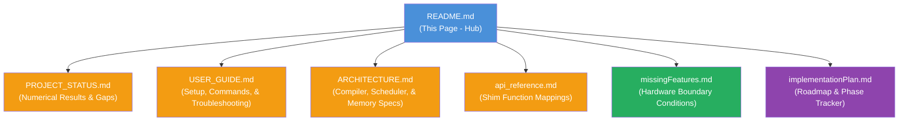

# VGRE Technical Documentation

Welcome to the VGRE (Virtual GPU Runtime Engine) technical documentation suite. VGRE is a high-fidelity CUDA execution runtime designed to run unmodified GPU workloads (CUDA, cuBLAS, cuDNN, cuSPARSE, cuSolver, cuRAND, NCCL) natively on multi-core host CPUs (x86-64 and ARM64) on Linux, Windows, and macOS.

---

## 🗺️ Unified Documentation Index

To keep VGRE technical documentation highly accurate, clear, and non-overlapping, we maintain **seven canonical reference manuals**:



### 1. 📈 [PROJECT_STATUS.md](PROJECT_STATUS.md)
*   **Purpose**: The single source of truth for VGRE capability, build metrics, and gaps.
*   **Key Contents**:
    *   Test suite statistics (full Linux suite passing).
    *   Core numerical verification guarantees.
    *   **Actual, verified hardware limitations and gaps** (SASS binary limits, CUPTI hardware counter scaling, and physical GPUDirect RDMA proxies) with no historical clutter.
*   **Read When**: You want to check what specific CUDA/library features are numerical-exact or where emulation boundary conditions reside.

### 2. 🚀 [USER_GUIDE.md](USER_GUIDE.md)
*   **Purpose**: The complete operator's manual for VGRE deployment and troubleshooting.
*   **Key Contents**:
    *   Quick-start commands and system requirements for Linux, Windows, and macOS.
    *   Installation, compilation options, and PyTorch/TensorFlow interception setups (`LD_PRELOAD`).
    *   Cluster environment setups, `vgre-token` authentication, and `vgre-discover` WAN setups.
    *   Comprehensive Environment Variables reference (including Configuration Manager hot-reloading).
    *   Detailed troubleshooting guide, covering Windows WSAStartup sockets, port conflicts, DLL dependency mapping, and native SIMD optimization.
*   **Read When**: You are installing, running, configuring, or debugging VGRE in single-node or distributed cluster environments.

### 3. 🏗️ [ARCHITECTURE.md](ARCHITECTURE.md)
*   **Purpose**: The developer's technical blueprint detailing VGRE's internal systems.
*   **Key Contents**:
    *   Clang JIT compiler mechanics, PTX register scanning (`.reg`), and persistent disk/memory LRU JIT cache models.
    *   UVM memory architecture, O(1) RadixPageTable signal mapping, slab-based pool allocator, and dynamic page migration.
    *   Asynchronous multi-stream scheduler (lock-free WorkItem scheduling).
    *   CPU parallel executor, two-level BlockWorkerPool dispatch, sense-reversing barrier objects, and cooperative launch gates.
    *   MPS Multi-Process IPC server (domain sockets and named pipes) and dynamic configuration file hot-reloading threads.
    *   Security layer (HMAC-SHA256, AES-256-CTR encryption, and secure keyring token storage).
*   **Read When**: You are contributing code to VGRE, inspecting compiler translation routines, or optimizing thread synchronizations.

### 4. 📚 [api_reference.md](api_reference.md)
*   **Purpose**: Comprehensive checklist of supported CUDA, cuDNN, cuBLAS, cuSPARSE, cuSolver, and NCCL APIs.
*   **Key Contents**:
    *   Exact function names, shim mappings, and support category classifications.
    *   Direct identification of return codes and parameter forwarding logic.
*   **Read When**: You need to verify if a specific CUDA function or library routine is directly compiled and mapped.

### 5. ⚠️ [missingFeatures.md](missingFeatures.md)
*   **Purpose**: Exhaustive, authoritative ledger of hardware-level architectural boundaries that represent permanent or long-term limitations of a CPU-based emulator.
*   **Key Contents**:
    *   SASS binary execution constraints, CUPTI PMU proxy boundaries, cuDNN v9 Graph API coverage, and GPUDirect RDMA status.
    *   Distinguishes clean-error-propagation boundaries from software bugs.
*   **Read When**: You need to know what a VGRE-based application cannot do versus what a physical NVIDIA GPU can do.

### 6. 🗺️ [implementationPlan.md](implementationPlan.md)
*   **Purpose**: Forward-looking development roadmap organized into numbered tracks (1–10).
*   **Key Contents**:
    *   Per-phase completion tables (Phase 7 → 131/131 baseline; Phase 8 → 131/131 post-math-hardening; Phases 9–10 heuristic elimination).
    *   Detailed engineering specifications for future tracks (SASS ISA emulation, CUPTI hardware passthrough, K8s orchestration, cuDNN v9 graph fusion).
*   **Read When**: You are planning new feature contributions or tracking which development phases have been completed.

---

## 🏆 Platform Feature Matrix

VGRE is designed as a cross-platform system, utilizing platform-native bindings to provide identical numerical results:

| Feature | Linux | Windows | macOS |
|---|---|---|---|
| **Interception** | `LD_PRELOAD` | PATH / DLL Proxy | `DYLD_INSERT_LIBRARIES` |
| **UVM Memory Trap** | `SIGSEGV` Signal | Vectored Exception (VEH) | `SIGSEGV` Signal |
| **Thread Affinity** | `sched_setaffinity` | `SetThreadAffinityMask` | macOS Thread Bind |
| **Cluster Sockets** | POSIX Sockets | Winsock2 | POSIX Sockets |
| **IPC Channels** | Unix Domain Sockets | Named Pipes | Unix Domain Sockets |
| **Thermal Sensing** | `/sys/class/thermal` | WMI COM Thread | IOKit SMC Keys |
| **Secure Keyring** | Linux Keyring (`keyctl`) | Credential Manager | macOS Keychain |
| **TPM 2.0 Storage** | `libtss2-esys` (auto) | TPM 2.0 (auto) | TPM 2.0 (auto) |
| **GNOME Keyring** | `libsecret-1` (auto) | N/A | N/A |
| **RDMA Transport** | `libibverbs` (auto) | N/A | N/A |
| **Telemetry PMU** | `perf_event_open` | QueryThreadCycleTime | mach_thread_self user-time |

---

## ⚡ Quick Verification

To verify that VGRE is fully functional and optimized on your local host:

```bash
# 1. Build the library (optimized)
mkdir -p build && cd build
cmake -DCMAKE_BUILD_TYPE=Release ..
cmake --build . -j$(nproc)

# 2. Run the complete test suite (full Linux suite passing)
ctest --output-on-failure -j$(nproc)
```

For custom configurations, cluster configurations, or framework deployments, please refer to the appropriate manuals in the navigation index.
