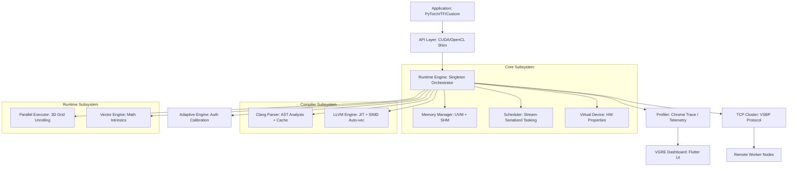

# VGRE Architecture (v0.1.2)

## System Overview

VGRE (Virtual GPU Runtime Engine) is a strictly authoritative, zero-simulation GPU execution system. Unlike traditional emulators that "fake" GPU responses, VGRE executes CUDA and OpenCL kernels as native CPU code, leveraging LLVM JIT, OpenMP parallelism, and advanced SIMD (AVX2/AVX-512). Key features include:

- **Full Texture & Surface API**: Hardware-backed realization of `cudaArray_t` for 1D/2D/3D texture fetching with bilinear/cubic filtering and all addressing modes.
- **Dynamic JIT Kernel Fusion**: Automatic optimization pass within `GraphManager` to fuse consecutive compatible kernels into a single compiled unit.
- **Auth Calibration**: Adaptive execution engine for ground-truth performance modeling with per-kernel thread-count tuning.
- **Authenticated Cluster Networking**: VSBP protocol over TCP with HMAC-SHA256 authentication and AES-256-CTR encryption.

## Component Diagram



---

## Deep-Dive: JIT Kernel Compilation Pipeline

Every kernel goes through a 4-stage pipeline on first launch:

```
 Kernel source string (CUDA C)
        │
        ▼
 ┌──────────────────────────────────────────────────────────┐
 │  Stage 1: ClangKernelParser (clang_kernel_parser.cpp)    │
 │  • Invokes `clang++ -Xclang -ast-dump=json` subprocess  │
 │  • Parses JSON AST: extracts argument names/types,       │
 │    shared-memory declarations, __syncthreads usage,      │
 │    template specialisations, FunctionTemplateDecl        │
 │  • Two-level cache: memory (100 entries) + disk          │
 │    ~/.vgre/cache/<hash16>/<hash>.ast.json                │
 │  • Cache hit: 0ms; first parse: <1s typical              │
 └──────────────────────────────────────────────────────────┘
        │  KernelIR (name, args, sharedMemSize, argTypes)
        ▼
 ┌──────────────────────────────────────────────────────────┐
 │  Stage 2: LLVMTranslationEngine — Wrapper Generation     │
 │  (llvm_translation_engine.cpp)                           │
 │  • Generates a C++ wrapper that:                         │
 │    – Substitutes threadIdx/blockIdx/blockDim/gridDim     │
 │      via Thread-Local Storage pointers (zero-copy)       │
 │    – Implements __syncthreads via per-block barrier       │
 │    – Declares texture builtins (vgre_tex1D_f32, etc.)    │
 │      resolved from absoluteSymbols JIT map               │
 │    – Unpacks void** args using inferred ArgType array     │
 │    – Dispatches blocks with vgre_jit_block_dispatch()    │
 │  • Writes to /tmp/vgre_jit_<name>_<uid>.cpp             │
 └──────────────────────────────────────────────────────────┘
        │  Generated C++ source file
        ▼
 ┌──────────────────────────────────────────────────────────┐
 │  Stage 3: Clang Compilation → LLVM IR                    │
 │  • clang++ -O3 -march=native -fopenmp -emit-llvm -S     │
 │  • Produces .ll (LLVM IR text) with auto-vectorisation   │
 └──────────────────────────────────────────────────────────┘
        │  LLVM IR module
        ▼
 ┌──────────────────────────────────────────────────────────┐
 │  Stage 4: LLVM ORC JIT — Native Code Generation          │
 │  • LLJITBuilder with O3 CodeGenOptLevel::Aggressive      │
 │  • CPU feature string includes all detected SIMD caps    │
 │    (AVX-512F, AVX2, FMA, SSE4.2, etc.)                  │
 │  • Result stored as JITResult (metadata-rich structure): │
 │    – fn: raw CompiledKernelFn                            │
 │    – argSizes: inferred from AST                         │
 │    – sharedMemSize: static + dynamic                     │
 │    – estimatedInstructionCount: from LLVM analysis       │
 │  • Memory-persistent cache (with recursive_mutex guard)  │
 └──────────────────────────────────────────────────────────┘
        │  JITResult
        ▼
 CPUParallelExecutor: Enqueues tasks to BlockWorkerPool.
- For synchronized kernels: Uses persistent pool of workers.
- For syncthreads detection: Enforces serial block dispatch to prevent pool starvation.
```

---

## Deep-Dive: Unified Virtual Memory (UVM) Signal Handler

`cudaMallocManaged()` → `MemoryManager::allocateManaged()`:

1. **Reserve with no-access mapping**:
   - Linux: `mmap(addr, size, PROT_NONE, MAP_ANONYMOUS|MAP_PRIVATE)`
   - Windows: `VirtualAlloc(addr, size, MEM_RESERVE, PAGE_NOACCESS)`

2. **Register SIGSEGV / VEH handler** (done once at MemoryManager init):
   - Linux: `sigaction(SIGSEGV, ...)` — handler stored in `struct sigaction`
   - Windows: `AddVectoredExceptionHandler(1, vgreVEHHandler)`

3. **Page fault on first access**:
   - Signal/exception is caught; faulting address extracted (`si_addr` / `ExceptionInformation[1]`)
   - `ManagedRegion` identified via `MemoryIntervalTree<ManagedRegion>` (RCU-protected, signal-safe)
   - Linux: `mprotect(page_base, page_size, PROT_READ|PROT_WRITE)` unlocks the page
   - Windows: `VirtualProtect(page_base, page_size, PAGE_READWRITE, ...)`
   - Page marked as dirty in the region's dirty bitmap (4 KB granularity, atomic bit operations)

4. **Access tracking**:
   - UVM metrics: per-region atomic access count, nanosecond last-access timestamp
   - Dirty page ranges exported via `getDirtyPages()` / `clearDirtyPages()`

5. **Cluster dirty-page transfer** (`tcp_cluster.cpp`):
   - Dirty ranges sent as `DATA_HEADER_DIRTY` + `DIRTY_RANGE` + `DATA_SHM_DIRTY` packets
   - Remote node applies patches to its own managed memory copy
   - Full coherence ensured before partitioned kernel dispatch

---

## Deep-Dive: TCP Cluster Architecture (VSBP v0.1.2)

VGRE implements a master/worker cluster using the **VGRE Structured Binary Protocol (VSBP)**:

```
 Master node                              Worker node
 ─────────────                            ───────────
 TCPClusterManager (isMaster=true)        TCPClusterManager (isMaster=false)
        │                                        │
        │◄── UDP announcement (port 7778) ───────┤
        │                                        │
        │◄── TCP connect (port 7000) ────────────┤
        │                                        │
        │── SECURE_HANDSHAKE ──────────────────►│
        │   • exchange 16-byte nonces             │
        │   • both derive session key:            │
        │     PBKDF2-HMAC-SHA256(                 │
        │       auth_token, n_master||n_client,   │
        │       200000 iterations)                │
        │   • session cipher: AES-256-CTR        │
        │   • MAC: HMAC-SHA256 (Encrypt-then-MAC)│
        │◄── SECURE_HANDSHAKE_ACK ───────────────┤
        │                                        │
        │◄── CAPABILITY ──────────────────────────┤  cpu_cores, ram, igpu_name
        │   (worker reports its own hardware)    │
        │                                        │
        │── REGISTER_KERNEL ─────────────────────►│  compile on worker
        │◄── RESPONSE ───────────────────────────┤
        │                                        │
        │── PARTITION_DISPATCH ──────────────────►│  sub-grid bounds + grid_start offset
        │   (WorkloadPartitioner: recursive       │  + compressed memory (LZ4)
        │    bisection by cpu_cores×gflops/lat)  │
        │◄── PARTITION_RESULT ───────────────────┤  dirty pages
        │                                        │
        │── ROTATE_KEY ──────────────────────────►│  periodic nonce rotation
        │   (every 10,000 packets per session)   │  (master-initiated)
        │                                        │
        │── CREDIT_REPORT ───────────────────────►│  billing (CUS: compute-unit-seconds)
```

**22 VSBP packet types**: TELEMETRY, LAUNCH_KERNEL, RESPONSE, DATA_HEADER, DATA_BODY, STRUCT_DATA, ARG_SCALAR, ARG_POINTER, CAPABILITY, REGISTER_KERNEL, SECURE_HANDSHAKE, SECURE_HANDSHAKE_ACK, PARTITION_DISPATCH, PARTITION_RESULT, CREDIT_REPORT, ROTATE_KEY, SHM_INIT, DATA_SHM, DATA_HEADER_DIRTY, DATA_SHM_DIRTY, DIRTY_RANGE, COOP_BARRIER_SYNC.

**Local-loopback optimisation**: When master and worker are on the same host (127.0.0.1), VSBP switches to POSIX/Windows shared-memory transport (`ShmManager`) with a 256 MB segment, bypassing TCP for data transfers. The worker-side SHM result-write cursor (`result_shm_offset_`) is a per-`DispatchManager` member starting at 128 MB, wraps on exhaustion, and resets to zero on reconnect.

**Rate limiting**: The master enforces ≤10 new TCP connections per source IP per 60-second window to prevent PBKDF2 exhaustion DoS.

### Modular Architecture

`TCPClusterManager` is a thin coordinator; all logic lives in seven focused sub-modules:

| Module | File | Responsibility |
|--------|------|----------------|
| `ConnectionManager` | `tcp_cluster/connection_manager.cpp` | Socket accept/connect, keepalive, duplicate guard, client vector |
| `DiscoveryManager` | `tcp_cluster/discovery_manager.cpp` + `discovery_loops.cpp` | UDP master/worker broadcast, proactive TCP connections, tracked auth threads |
| `PacketHandler` | `tcp_cluster/packet_handler.cpp` | VSBP framing, sequence counter, direct send/recv |
| `SecurityManager` | `tcp_cluster/security_manager.cpp` | PBKDF2 handshake, AES-256-CTR channel, periodic key rotation |
| `MemorySyncManager` | `tcp_cluster/memory_sync_manager.cpp` | Delta/full sync with exponential backoff, SHM fast path |
| `CollectiveOpsManager` | `tcp_cluster/collective_ops_manager.cpp` | AllReduce (AVX2/SSE2/scalar), barrier, telemetry aggregation |
| `DispatchManager` | `tcp_cluster/dispatch_manager.cpp` + `dispatch_impl.cpp` | Remote and partitioned kernel launch, result collection |

All modules access `TCPClusterManager` state through a `parent_` pointer; the `friend class` declarations in `tcp_cluster.h` grant the required access.

**Periodic key rotation**: The master's `serverLoop` checks each active, security-established client after every TSS2 flush. When `client->packets_sent` reaches 10,000, `SecurityManager::rotateSessionKey()` sends a `ROTATE_KEY` packet with a fresh nonce, then advances the local AES-CTR nonce. The counter resets to zero on successful rotation.

**Auth-thread lifetime safety**: Proactive connections spawn a handshake thread per new worker. These threads are stored in `DiscoveryManager::auth_threads_` (under `auth_threads_mutex_`) instead of being detached. `DiscoveryManager::stopAll()` joins the proactive loop first (preventing new threads from being created), then joins all outstanding auth threads — guaranteeing no thread accesses a destroyed `TCPClusterManager`.

---

## Memory Architecture

```
 ┌─────────────────────────────────────────────────────────┐
 │  MemoryManager (Singleton, 4 GB virtual pool)           │
 │                                                         │
 │  ┌───────────────────────────────────────────────────┐  │
 │  │  Allocation Map (handle → AllocationInfo)        │  │
 │  │  • cudaMalloc: aligned_alloc (no page protection)│  │
 │  │  • cudaMallocManaged: mmap(PROT_NONE) + SIGSEGV  │  │
 │  │  • Pool alloc: stream-ordered free-list reuse     │  │
 │  └───────────────────────────────────────────────────┘  │
 │                                                         │
 │  ┌───────────────────────────────────────────────────┐  │
 │  │  ManagedRegion Interval Tree (RCU-protected)     │  │
 │  │  Signal-safe lookup for SIGSEGV handler          │  │
 │  │  Stores: dirty bitmap, access counts, preferred  │  │
 │  │          device, conflict counts, timestamps      │  │
 │  └───────────────────────────────────────────────────┘  │
 │                                                         │
 │  Dirty Page Tracking: 4 KB granularity atomic bitmaps  │
 │  P2P Access Matrix: per-device-pair access flags       │
 └─────────────────────────────────────────────────────────┘
```

---

## Security Architecture

| Layer | Mechanism | Strength |
|-------|-----------|---------|
| Auth token storage | Linux keyring / macOS Keychain / Windows CredMan / TPM 2.0 | Platform-native OS security |
| Token file fallback | PBKDF2-SHA256 (100k iter) + SHA-256-CTR + HMAC-SHA256 | Authenticated encryption |
| Session key derivation | PBKDF2-HMAC-SHA256 (200k iter, per-session nonces) | Brute-force resistant |
| Channel encryption | AES-256-CTR (software; AES-NI pending) | Confidentiality |
| Channel authentication | HMAC-SHA256, Encrypt-then-MAC | Integrity + replay protection |
| Periodic key rotation | Master-initiated ROTATE_KEY every 10,000 packets; fresh nonce per interval | Limits ciphertext volume under one key |
| DoS protection | Per-IP rate limiter (10 connections / 60s) | Handshake flood mitigation |

---

## Recently Implemented Innovations

The following items graduated from the roadmap and are fully implemented:

4. **OpenTelemetry OTLP Export** ✅: `RuntimeProfiler::toOTLPJSON()` generates W3C OTLP JSON;
   `exportOTLPToHTTP(endpoint)` posts to any OTLP HTTP collector (Jaeger, Tempo, Grafana) via
   raw TCP — no libcurl dependency. Each kernel run becomes a span with `vgre.gflops`,
   `vgre.throughput_gbps`, and `vgre.grid_dim` attributes.
5. **NUMA-Aware Scheduling** ✅: `Scheduler::buildNumaTopology()` discovers NUMA nodes via
   `/sys/devices/system/cpu/cpuN/node`, pins each worker thread with `pthread_setaffinity_np`,
   and routes `submitNumaTask()` calls to per-NUMA priority queues. Work-steals to global queue
   when local queue is empty.
6. **Cluster Secure-Channel Bug Fixes** ✅ (2026-04-12): Three interrelated bugs eliminated in
   `tcp_cluster.cpp`: (a) `performSecureHandshake` now uses a bounded `recv()` loop capped at
   exactly `sizeof(VSBPHeader)+sizeof(SecureHandshakePacket)` bytes — prevents over-reading into
   the next encrypted packet and stops the HMAC verification failure loop; (b) `syncToIPC()` and
   `getConnectedNodes()` filter to `active=true` nodes only — eliminates zero CPU/RAM display
   during reconnect; (c) 8-second `proactive_backoff_until_` entry after disconnect — gives the
   dashboard a visible disconnect window.
7. **Graph Cloning** ✅ (2026-04-12): `cudaGraphClone()` / `vgre_graphClone()` fully implemented
   through all four layers (GraphManager → RuntimeEngine → CUDAInterceptor → cudart_shim).
   Deep-copies all nodes, captured argument buffers, and dependency edges into a new independent
   graph.

## Remaining Roadmap

1. **Interactive 3D Hardware Topology Viewer**: A Flutter frontend update featuring a 3D representation of cluster and node PCIe/Memory topology.
2. **Agentic "AI Tuner" Interface**: An embedded AI chat UI enabling real-time natural-language tuning commands ("Optimize cluster for latency").
3. **AES-NI Acceleration**: Replace software AES with `__builtin_ia32_aesenc128` for hardware-accelerated throughput.
4. **libsecret Backend**: Link `libsecret` for GNOME Keyring integration on headless Linux servers where the kernel keyring isn't accessible.

## Feature Coverage

For a current snapshot of which features are fully implemented, see [docs/feature_matrix.md](feature_matrix.md).
