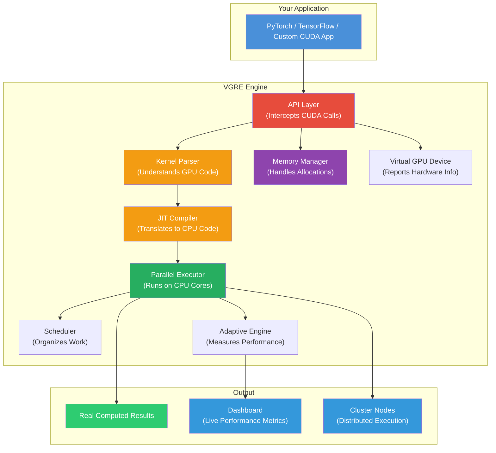
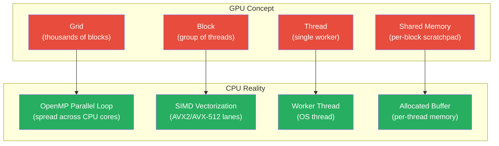
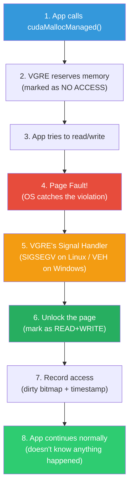
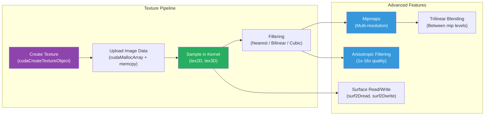
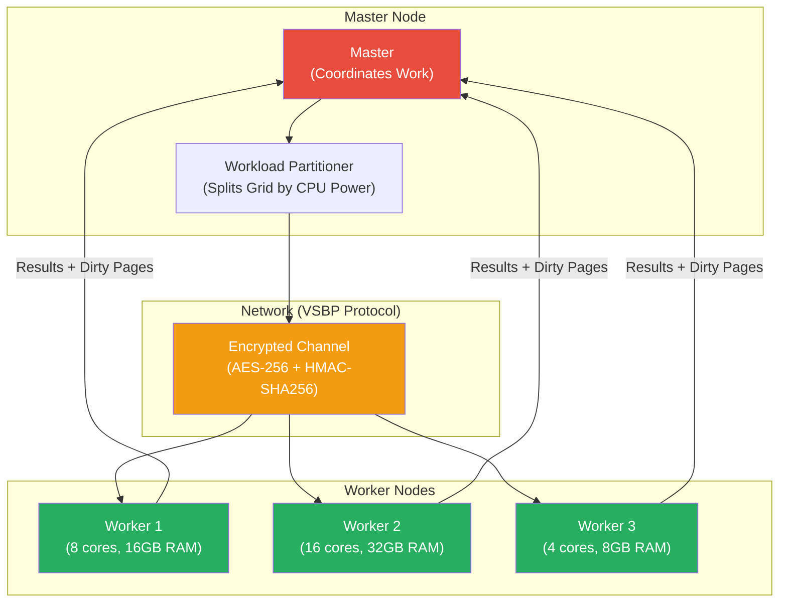
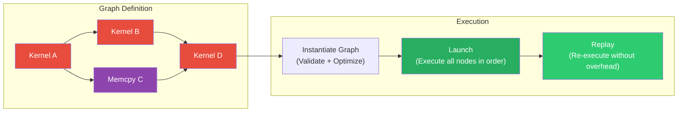
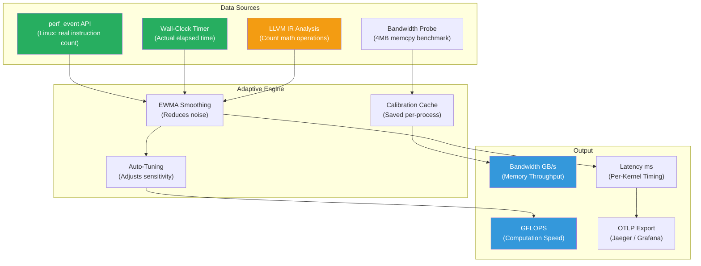
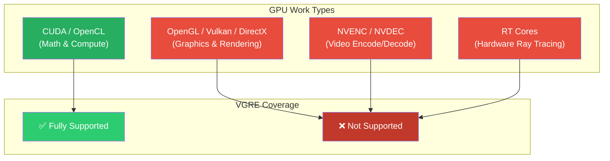
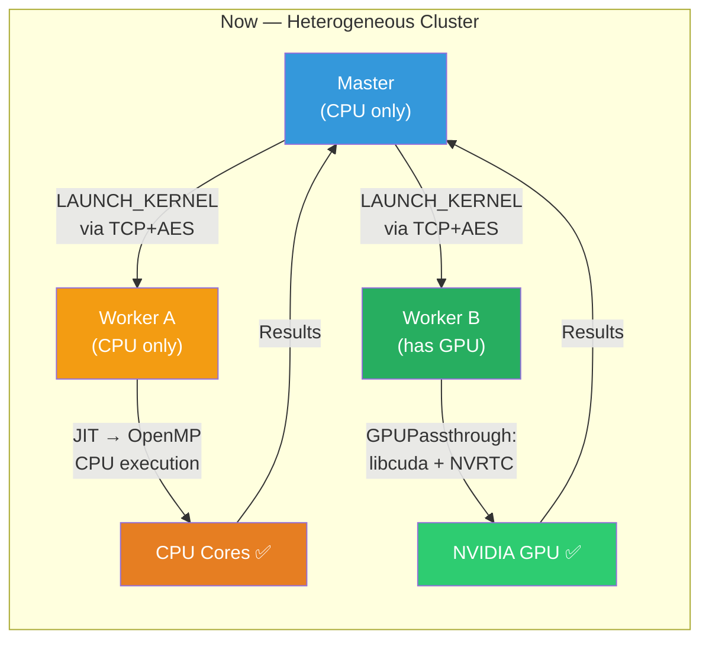

# How VGRE Works

**Version**: 0.3.0 — Last updated: 2026-05-03

---

## What Is VGRE?

**VGRE** (Virtual GPU Runtime Engine) lets you run GPU applications **without a physical GPU**. Instead of buying an expensive NVIDIA graphics card, VGRE translates GPU code into CPU code and runs it natively on your processor.

**Think of it like this**: If a GPU application is a recipe written in French (CUDA), VGRE is a translator that rewrites it into English (CPU instructions) so your computer can follow the recipe — and it actually cooks the meal, not just pretends to.

> **Key principle**: VGRE is NOT a simulator. It does not fake results. Every computation runs for real on your CPU, producing identical outputs to a physical GPU.

---

## Glossary — Abbreviations Used in the Codebase

| Abbreviation | Full Name | What It Means |
|---|---|---|
| **VGRE** | Virtual GPU Runtime Engine | The project itself — runs GPU code on CPUs |
| **CUDA** | Compute Unified Device Architecture | NVIDIA's programming language for GPUs |
| **JIT** | Just-In-Time (Compilation) | Compiling code right before it runs, not ahead of time |
| **LLVM** | Low Level Virtual Machine | A compiler framework that translates code into native CPU instructions |
| **ORC** | On-Request Compilation | LLVM's JIT engine that compiles code when needed |
| **IR** | Intermediate Representation | A middle-step format between source code and machine code |
| **UVM** | Unified Virtual Memory | Memory shared between "GPU" and "CPU" — accessed by both without manual copying |
| **SHM** | Shared Memory | Memory visible to all threads within a block (fast scratchpad) |
| **NUMA** | Non-Uniform Memory Access | Multi-socket CPU architecture where memory access speed depends on which CPU socket owns the memory |
| **IPC** | Inter-Process Communication | Mechanisms for separate processes to share data (e.g., shared memory segments) |
| **SIMD** | Single Instruction, Multiple Data | CPU feature that processes multiple values in one operation (e.g., 8 floats at once with AVX2) |
| **AVX** | Advanced Vector Extensions | Intel/AMD SIMD instruction sets (AVX, AVX2, AVX-512) |
| **TLS** | Thread-Local Storage | Data private to each thread — prevents conflicts between parallel workers |
| **VSBP** | VGRE Structured Binary Protocol | Network protocol for cluster communication between VGRE nodes |
| **HMAC** | Hash-based Message Authentication Code | Cryptographic signature proving a message hasn't been tampered with |
| **AES** | Advanced Encryption Standard | Industry-standard encryption algorithm (AES-256-CTR used for cluster traffic) |
| **PBKDF2** | Password-Based Key Derivation Function 2 | Algorithm that derives a strong encryption key from a password/token |
| **EWMA** | Exponential Weighted Moving Average | Smoothing technique that gives more weight to recent measurements |
| **GFLOPS** | Giga Floating-Point Operations Per Second | Measure of computation speed (billions of math operations per second) |
| **VEH** | Vectored Exception Handler | Windows mechanism for catching memory access violations (like SIGSEGV on Linux) |
| **OTLP** | OpenTelemetry Protocol | Standard format for exporting performance traces to monitoring tools |
| **DAG** | Directed Acyclic Graph | A workflow where tasks have dependencies but no circular loops |
| **RCU** | Read-Copy-Update | Lock-free technique for safely reading shared data while another thread updates it |
| **LOD** | Level of Detail | Selecting coarser/finer texture resolution based on distance |
| **SM** | Streaming Multiprocessor | GPU hardware unit that runs groups of threads — VGRE maps this to CPU core capability |

---

## The Big Picture — How Everything Connects



---

## Step-by-Step: What Happens When You Run a GPU Program

### Step 1 — Your App Calls CUDA

Your application calls `cudaLaunchKernel(...)` thinking it's talking to a real GPU.

VGRE intercepts this call using `LD_PRELOAD` (Linux) or DLL injection (Windows). The app never knows the difference.

### Step 2 — Parsing the Kernel

The **Kernel Parser** reads the GPU code (written in CUDA C) and extracts:
- What arguments the function takes (pointers, integers, floats)
- Whether it uses shared memory (fast scratchpad memory within a block)
- Whether it uses `__syncthreads()` (barrier synchronization between threads)
- Whether it uses warp-level shuffles (`__shfl_sync`) — forces parallel block execution
- Whether it contains inline PTX assembly (`asm(...)`) — triggers PTX→C++ translation

### Step 3 — Compiling to CPU Code (JIT)

The **LLVM Translation Engine** converts GPU code into native CPU code through 4 stages:


**Caching**: Once compiled, the result is saved to disk (`~/.vgre/cache/`). Next time the same kernel runs, it loads instantly (0ms) instead of recompiling.

### Step 4 — Executing on CPU Cores

The **CPU Parallel Executor** maps GPU concepts to CPU resources:



### Step 5 — Results

The computed results are written directly to host memory. Since VGRE runs on the CPU, there's no "GPU-to-CPU transfer" — the results are already where your app expects them.

---

## How Memory Works

### Regular Memory (`cudaMalloc`)

Simple: allocates aligned memory on the host. Your app writes to it, reads from it — no tricks needed.

### Unified Virtual Memory — UVM (`cudaMallocManaged`)

UVM is the clever part. It lets both "GPU code" and "CPU code" access the same memory address without manual copying.



**Why?** This gives VGRE precise knowledge of which memory pages are being used, when, and by which part of the program — enabling smart decisions about where to place memory on multi-socket (NUMA) systems.

### Shared Memory — SHM (`__shared__`)

In real GPUs, shared memory is a fast scratchpad visible to all threads in a block. VGRE implements this as a pre-allocated buffer that's pointer-swizzled into the kernel at compile time:

- `__shared__ float s[256]` → becomes a pointer into the buffer: `float* s = (float*)(buffer + offset)`
- Each OpenMP thread gets its own buffer — no conflicts between blocks running in parallel

### Memory Pools (`cudaMallocAsync`)

For apps that allocate/free memory rapidly, VGRE maintains free-lists that reuse blocks instead of calling the OS allocator each time. This avoids the overhead of thousands of `malloc`/`free` calls per second.

---

## How Rendering and Graphics Are Supported

VGRE supports texture and surface operations used in graphics and machine learning:



**Texture fetching** (e.g., `tex2D(texture, x, y)`) is implemented through built-in functions that the JIT compiler resolves at compile time. The `TextureManager` stores image data in host memory and performs real filtering math (bilinear interpolation, cubic Catmull-Rom, anisotropic multi-sampling).

---

## How the Cluster Works (Multi-Machine Execution)

VGRE can distribute work across multiple machines over a network:



**How it works**:
1. **Discovery**: Nodes find each other via UDP broadcast (or manual `VGRE_CLUSTER_NODES` config)
2. **Authentication**: HMAC-SHA256 handshake verifies both sides have the same auth token
3. **Encryption**: All traffic encrypted with AES-256-CTR (keys rotate every 10,000 packets)
4. **Partitioning**: The master splits the kernel grid proportionally to each node's CPU power
5. **Execution**: Each node runs its slice and sends back results + modified memory pages
6. **SHM Fast Path**: When master and worker are on the same machine, data bypasses the network and uses shared memory (SHM) instead

---

## How CUDA Graphs Work

CUDA Graphs let apps define a **workflow once** and replay it many times without re-submitting individual operations:



VGRE supports: graph creation, node dependencies, cloning, serialization/deserialization (JSON), stream capture, conditional nodes (IF/WHILE), and graph updates.

---

## Advanced CUDA Features (Phase 2)

### Warp-Level Intrinsics (`__shfl_sync`, `__ballot_sync`)

Modern AI kernels use warp shuffles for fast reductions without shared memory. VGRE implements these via a **per-block warp exchange buffer** (64-bit slots, one per lane):

| CUDA Intrinsic | What It Does | VGRE Implementation |
|---|---|---|
| `__shfl_sync` | Masked lane exchange | Write to warp buffer (mask-gated) → barrier → read src lane |
| `__shfl_down_sync` | Shift down by delta; clamped at segment end | srcLane = lane+delta; returns own value past segment boundary |
| `__shfl_up_sync` | Shift up by delta; clamped at segment base | srcLane = lane-delta; returns own value below segment base |
| `__shfl_xor_sync` | Butterfly swap for reductions | srcLane = lane XOR laneMask; mask-gated write |
| `__ballot_sync` | Bitmask of predicates within mask | Each masked lane contributes bit; non-masked bits zeroed |
| `__activemask()` | Get active lane mask | Returns 0xFFFFFFFF (all lanes active on CPU) |
| `__popc`, `__clz`, `__ffs` | Bit counting | Maps to GCC/Clang `__builtin_popcount`/`__builtin_clz`/`__builtin_ffs` |

Kernels using warp shuffles are **always run in parallel block mode** (each CUDA thread on its own OS thread) — this is enforced even for single-thread blocks so the warp buffer can be simultaneously populated by all lanes.

### FP16 (`__half`) and BFloat16

Both 16-bit float formats are supported with full operator sets:

| Type | Precision | Use Case | VGRE File |
|---|---|---|---|
| `__half` | FP16 (5-bit exp, 10-bit mantissa) | Standard AI inference | `cpu_cuda_fp16.h` |
| `__nv_bfloat16` | BF16 (8-bit exp, 7-bit mantissa) | Training (wider range) | `cpu_cuda_env.h` |

Operations: `__hadd`, `__hmul`, `__hfma`, `__hsub`, `__hdiv`, `__hexp`, `__hsqrt`, `__float2half`, `__half2float`, comparisons, `__half2` vector type.

### Tensor Core Emulation (WMMA)

The `nvcuda::wmma` namespace enables matrix multiply-accumulate (MMA) operations used by LLaMA, BERT, and other large models. VGRE implements the full tile API using scalar FP32 math:

```cpp
// Standard WMMA usage — works identically in VGRE
nvcuda::wmma::fragment<matrix_a, 16, 16, 16, __half, row_major> a;
nvcuda::wmma::fragment<matrix_b, 16, 16, 16, __half, col_major> b;
nvcuda::wmma::fragment<accumulator, 16, 16, 16, float> c;
nvcuda::wmma::fill_fragment(c, 0.0f);
nvcuda::wmma::load_matrix_sync(a, ptr_a, 16);
nvcuda::wmma::load_matrix_sync(b, ptr_b, 16);
nvcuda::wmma::mma_sync(c, a, b, c);
nvcuda::wmma::store_matrix_sync(ptr_c, c, 16, mem_row_major);
```

### CUDA Dynamic Parallelism (CDP)

Kernels can spawn child kernels using `cudaGetParameterBuffer` and `cudaLaunchDevice`. Child kernels are enqueued into a `CDPExecutor` queue and drained after the parent block completes — preserving CUDA's depth-first execution order.

### cuBLAS and cuDNN Shims

VGRE intercepts `libcublas.so` and `libcudnn.so` calls and routes them to CPU implementations:

**cuBLAS**: `cublasSgemm`, `cublasDgemm`, `cublasSaxpy`, `cublasSdot`, `cublasSgemv`, and more. Uses OpenBLAS when available, falls back to a built-in reference implementation.

**cuDNN**: `cudnnConvolutionForward` (1×1 GEMM with stride support + direct 2D; Winograd selected when applicable), `cudnnPoolingForward` (MaxPool, AvgPool with padding modes), `cudnnActivationForward` (ReLU/sigmoid/tanh/ELU/swish/clipped-ReLU), `cudnnSoftmaxForward` (INSTANCE and CHANNEL modes with numerically-stable log-sum-exp), `cudnnBatchNormalizationForwardInference`, plus all descriptor APIs.

### CUDA IPC (Multi-Process Memory Sharing)

PyTorch DDP and other multi-process frameworks use `cudaIpcGetMemHandle` to share GPU buffers between processes. VGRE implements this via POSIX shared memory:

```
Process A: cudaIpcGetMemHandle(&handle, devPtr)  → creates /vgre_ipc_XXX segment
Process B: cudaIpcOpenMemHandle(&ptr, handle, 0) → maps the same segment
Both:      read/write ptr as normal memory
Process B: cudaIpcCloseMemHandle(ptr)            → unmaps segment
```

### Inline PTX Assembly Translation

Kernels that use `asm("ptx instructions" : constraints)` are automatically translated before JIT compilation. 100+ PTX opcodes are mapped to equivalent C++:

| PTX Category | Examples | C++ Equivalent |
|---|---|---|
| Integer arithmetic | `add.s32`, `mul.lo.u64`, `mad.lo.u32` | `d = a + b;`, `d = (u64)(a*b);` |
| FP32/FP64 arithmetic | `fma.rn.f32`, `add.f64`, `div.rn.f64` | `d = a*b+c;`, `d = a+b;` |
| Memory loads | `ld.global.f32`, `ld.global.v4.f32`, `ld.shared.f32` | `d = *(float*)p;`, 4-wide vectorized |
| Memory stores | `st.global.v2.f32`, `st.shared.u32` | `vp[0]=a; vp[1]=b;` |
| Atomic operations | `atom.global.add.f32`, `atom.global.cas.b32` | `__atomic_fetch_add(...)` |
| Warp voting | `vote.sync.ballot.b32`, `activemask.b32` | `__ballot_sync(...)` |
| Warp shuffles | `shfl.sync.idx.b32`, `shfl.sync.down.b32` | `__shfl_sync(...)` |
| Predicates | `setp.lt.f32`, `selp.f32`, `@%p bra` | `p = a < b;`, `d = p ? a : b;` |
| Conversions | `cvt.rn.f32.f16`, `cvt.sat.u8.f32` | `d = (float)a;`, saturating cast |
| FP intrinsics | `ex2.approx.f32`, `sin.approx.f32` | `__builtin_exp2f(a)` |
| Barriers | `membar.gl`, `membar.sys` | `__atomic_thread_fence(__ATOMIC_SEQ_CST)` |

Unmapped instructions are emitted as `/* PTX: opcode operands */` comments — compilation succeeds and the unsupported operation becomes a no-op.

### GPU Passthrough for Cluster Workers

When a VGRE cluster worker has a physical NVIDIA GPU, it will automatically use it instead of the CPU JIT path:

```
Master                          Network (TCP+AES)              Worker GPU Node
──────                          ──────────────────             ───────────────
cudaMalloc(ptr, N)              
launchRemoteKernel()
  └── streamArgumentsToWorker()
        └── sendPointerArg()
              ├── DATA_HEADER(size, handle) ──────────────→  pending_target_ptr = handle
              ├── DATA_BODY(N bytes) ──────────────────────→  memcpy to host_ptr
              └── ARG_POINTER(arg_index, handle) ──────────→  pending_args[i].value = handle
  LAUNCH_KERNEL(grid,block,…) ─────────────────────────────→  handleRemoteCommand()

                                                               GPUPassthrough::launchOnGPU()
                                                                 ├── cuMemAlloc(devPtr, N)
                                                                 ├── cuMemcpyHtoD(devPtr, host_ptr, N)  [H2D]
                                                                 ├── cuLaunchKernel(fn, devPtr, …)
                                                                 ├── cuCtxSynchronize()
                                                                 └── cuMemcpyDtoH(host_ptr, devPtr, N)  [D2H]
                                                                     cuMemFree(devPtr)
                                                               host_ptr now has GPU results

                                                               pull-back:
                              ←─── DATA_HEADER(size, handle) ─┤
                              ←─── DATA_BODY(N GPU result bytes)
                              ←─── RESPONSE(kernel_id, SUCCESS)
memcpy to local ptr
(GPU results in master memory)
```

This enables heterogeneous clusters: CPU-only machines and GPU machines can work together in the same VGRE cluster.

---

## How Performance Measurement Works

VGRE doesn't guess performance — it **measures** it:



---

## How Synchronization Works

GPU programming has multiple synchronization barriers. Here's how VGRE implements each:

| GPU Concept | What It Does | VGRE Implementation |
|---|---|---|
| `__syncthreads()` | Waits for all threads in a block | Sense-reversing barrier in BlockWorkerPool |
| `this_grid().sync()` | Waits for all blocks in the entire grid | GridBarrierState — atomic counter + condition variable |
| `cudaStreamSynchronize()` | Waits for all work in a stream to finish | Scheduler drains the per-stream task queue |
| `cudaDeviceSynchronize()` | Waits for ALL work on ALL streams | Scheduler drains every queue |
| `cudaEventSynchronize()` | Waits for a specific recorded event | Event flag checked via atomic variable |

---

## Cross-Platform Support

VGRE runs on **Linux**, **Windows**, and **macOS**. The engine automatically adapts to each platform:

```mermaid
flowchart TB
    subgraph "VGRE Engine (Cross-Platform Core)"
        CORE["Shared Logic\n(Compilation, Execution, Scheduling)"]
    end

    subgraph "Linux"
        L1["SIGSEGV handler\n(UVM page faults)"]
        L2["perf_event\n(Instruction counting)"]
        L3["NUMA + mbind\n(Memory placement)"]
        L4["Linux Keyring\n(Token storage)"]
    end

    subgraph "Windows"
        W1["VEH handler\n(UVM page faults)"]
        W2["Performance counters"]
        W3["WinSock2\n(Networking)"]
        W4["Credential Manager\n(Token storage)"]
    end

    subgraph "macOS"
        M1["SIGSEGV handler\n(UVM page faults)"]
        M2["IOKit\n(Temperature monitoring)"]
        M3["SO_NOSIGPIPE\n(Socket safety)"]
        M4["Keychain\n(Token storage)"]
    end

    CORE --> L1 & L2 & L3 & L4
    CORE --> W1 & W2 & W3 & W4
    CORE --> M1 & M2 & M3 & M4

    style CORE fill:#3498db,color:#fff
    style L1 fill:#27ae60,color:#fff
    style L2 fill:#27ae60,color:#fff
    style L3 fill:#27ae60,color:#fff
    style L4 fill:#27ae60,color:#fff
    style W1 fill:#e74c3c,color:#fff
    style W2 fill:#e74c3c,color:#fff
    style W3 fill:#e74c3c,color:#fff
    style W4 fill:#e74c3c,color:#fff
    style M1 fill:#f39c12,color:#fff
    style M2 fill:#f39c12,color:#fff
    style M3 fill:#f39c12,color:#fff
    style M4 fill:#f39c12,color:#fff
```



---

## Key Configuration Options

| Variable | Default | What It Controls |
|---|---|---|
| `VGRE_DEVICE_COUNT` | auto | How many virtual GPUs to create |
| `VGRE_LOG_LEVEL` | `INFO` | How much detail to print (`DEBUG` for troubleshooting) |
| `VGRE_CACHE_DIR` | `~/.vgre/cache` | Where compiled kernels are cached |
| `VGRE_UVM_MIGRATION_MS` | `500` | How often to check for memory migration opportunities |
| `VGRE_ADAPTIVE_ALPHA` | `0.3` | How quickly performance predictions adapt to changes |
| `VGRE_TCP_AUTH_TOKEN_FILE` | — | Path to the cluster authentication token file |
| `VGRE_MESH_PEERS` | — | List of peer nodes for mesh networking |
| `VGRE_IPC_MODE` | `ON` | Enable/disable inter-process shared memory |
| `VGRE_BLOCK_THREADS` | `false` | Force multi-threaded block execution |
| `VGRE_GPU_PEAK_BANDWIDTH_GBPS` | `900` | Expected GPU bandwidth for telemetry comparison |

---

## Summary — Why VGRE Is Different

| Feature | Traditional Emulator | VGRE |
|---|---|---|
| Execution | Simulates GPU behavior | **Runs real code on CPU** |
| Results | May be approximate | **Bit-identical to GPU** |
| Performance data | Estimated/faked | **Measured from hardware** |
| Memory tracking | Simulated | **Real OS page faults** |
| Multi-machine | Rarely supported | **Encrypted cluster with auto-discovery** |
| Platform support | Usually Linux only | **Linux + Windows + macOS** |

---

## What VGRE Can and Cannot Do

### ✅ What VGRE Is Designed For

VGRE intercepts **CUDA and OpenCL compute APIs** — the math/science side of GPU programming:

| Use Case | How VGRE Helps |
|---|---|
| **AI / Machine Learning** (PyTorch, TensorFlow) | Run training and inference without a GPU — ideal for development, testing, CI/CD |
| **Scientific Computing** (CUDA kernels, simulations) | Develop and debug GPU code on any machine |
| **Data Processing** (cuBLAS, custom CUDA) | Process data with CUDA APIs on CPU hardware |
| **Education & Learning** | Learn CUDA programming without buying expensive hardware |
| **CI/CD Pipelines** | Run GPU test suites on cloud servers that have no GPUs |
| **Cluster Computing** | Distribute compute work across multiple CPU-only machines |
| **Algorithm Prototyping** | Test CUDA algorithms for correctness before deploying to real GPUs |

### ⚠️ What VGRE Can Run But Will Be Slower

For pure CUDA compute renderers, VGRE can execute the kernels — but a CPU with 16 cores **cannot match** a GPU with 10,000+ cores for massively parallel rendering:

| Software | Renderer | VGRE Status |
|---|---|---|
| **Blender** | Cycles (CUDA mode) | Runs correctly but **10-100x slower** than a real GPU. Blender already has a built-in CPU renderer — use that instead. |
| **V-Ray** | CUDA RT engine | Same — runs but impractical for production renders |
| **Arnold** | GPU mode (CUDA) | Same — use Arnold's native CPU mode instead |
| **OctaneRender** | CUDA only | Could run but extremely slow — not practical |

> **Bottom line**: If a renderer already has a "CPU mode", use that — it will be faster than routing CUDA through VGRE, because the CPU mode is optimized for CPU architecture while CUDA code is optimized for GPU architecture.

### ❌ What VGRE Cannot Do (Not Supported)

VGRE does **not** intercept graphics rendering APIs:



| Not Supported | Why | Impact |
|---|---|---|
| **OpenGL / Vulkan / DirectX** | These are graphics APIs for drawing — VGRE doesn't intercept them | AutoCAD, SolidWorks, Blender viewport, games will NOT work through VGRE |
| **NVENC / NVDEC** | Hardware video encode/decode — no CPU equivalent | Video editing GPU acceleration won't work |
| **RT Cores** | Hardware ray tracing units — CPU has no equivalent | Hardware-accelerated ray tracing not available |
| **CUDA↔OpenGL Interop** | Sharing buffers between CUDA and OpenGL | Apps that mix compute and graphics won't work |

### Rendering Software Compatibility

| Software | Viewport (3D display) | Render Engine | VGRE Verdict |
|---|---|---|---|
| **AutoCAD** | DirectX/OpenGL ❌ | CPU-based ✅ | **Cannot support viewport.** Use CPU rendering (already built-in). |
| **SolidWorks** | DirectX ❌ | CPU-based ✅ | **Cannot support viewport.** Use built-in CPU mode. |
| **Blender** | OpenGL ❌ | Cycles has CPU mode ✅ | **Cannot support viewport.** Use Cycles CPU renderer directly. |
| **3ds Max** | DirectX ❌ | V-Ray/Arnold CPU ✅ | **Cannot support viewport.** Use CPU render plugins. |
| **Maya** | OpenGL ❌ | Arnold CPU ✅ | **Cannot support viewport.** Use Arnold CPU mode. |
| **DaVinci Resolve** | OpenGL + CUDA ❌ | GPU-accelerated ❌ | **Not compatible.** Requires real GPU. |

> **In simple terms**: VGRE is a **compute engine**, not a **graphics engine**. It excels at running math-heavy CUDA programs.ograms (AI, simulations, data science) on CPUs — but it cannot display 3D graphics or accelerate rendering viewports.

---

## Cluster Scenarios — Can I Use a Friend's GPU?

### Scenario: "My machine has no GPU. My friend's machine has an NVIDIA GPU. Can I use VGRE clustering to run my CUDA code on their GPU?"

**Answer: Not currently.** Here's what happens today vs. what would be needed:



### What the Cluster CAN Do Today

| Scenario | Supported | Benefit |
|---|---|---|
| CPU machine → CPU machine(s) | ✅ Yes | Spread work across multiple CPU-only machines |
| 2-core laptop → 64-core server (CPU) | ✅ Yes | Use a powerful server's CPU for heavy compute |
| Multiple office PCs combined | ✅ Yes | Pool idle machines into a compute cluster |
| Encrypted communication | ✅ Yes | All traffic is AES-256 encrypted + HMAC authenticated |

### What the Cluster CAN Do (Updated — Phase 2)

| Scenario | Supported | How |
|---|---|---|
| CPU machine → CPU machine(s) | ✅ Yes | JIT → OpenMP execution |
| CPU machine → Friend's GPU machine | ✅ Yes | Full H2D→launch→D2H round-trip via libcuda.so + NVRTC |
| Heterogeneous cluster (mixed CPU+GPU nodes) | ✅ Yes | Each worker selects GPU or CPU automatically |
| GPU-to-GPU across network | ✅ Yes | TCP carries data between hosts; each side runs on its own GPU |
| Null/untracked pointer safety | ✅ Yes | Explicit null-pointer handling and size-0 warning in sendPointerArg |

### SHM Clarification

**SHM (Shared Memory) is NOT for cross-network GPU sharing.** It is a local optimization:

| SHM Scenario | What Happens |
|---|---|
| Master and Worker on **same machine** (127.0.0.1) | ✅ SHM used — data bypasses TCP, transferred via shared memory segment (256MB) for speed |
| Master and Worker on **different machines** | ❌ SHM not used — data transferred via TCP (encrypted) |
| Cross-network GPU access | ❌ SHM cannot do this — it's local-only |

### GPU Passthrough Worker (Implemented — Phase 2)

When a worker node has a physical NVIDIA GPU, VGRE automatically detects and uses it:

1. **GPU Detection** — `dlopen("libcuda.so.1")` + `cuInit` + `cuDeviceGetCount`
2. **Real CUDA Runtime Loading** — All driver API calls go through dynamically loaded function pointers
3. **Runtime Compilation** — Kernel source compiled to PTX via `libnvrtc.so` (NVRTC)
4. **GPU Execution** — `cuModuleLoadData` + `cuLaunchKernel` + `cuCtxSynchronize`
5. **CPU Fallback** — If GPU initialization or compilation fails, falls through to the normal CPU JIT path seamlessly

---

For more details, see:
- [PROJECT_STATUS.md](PROJECT_STATUS.md) — Component completion status
- [CROSS_PLATFORM_STATUS.md](CROSS_PLATFORM_STATUS.md) — Platform-specific implementation details
- [IMPLEMENTATION_ACTION_PLAN.md](IMPLEMENTATION_ACTION_PLAN.md) — Phase 2 roadmap
- [USER_GUIDE.md](USER_GUIDE.md) — How to install and use VGRE
