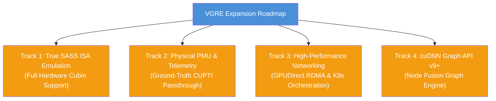
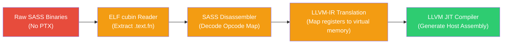
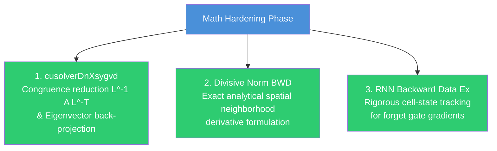

# VGRE Future Implementation Plan

**Version**: 10.0.0  
**Date**: 2026-05-29 (Consolidated Architecture Phase)  
**Status**: Forward-Looking Roadmap (For advanced phases beyond the core 130/130 verified baseline)

This document outlines the detailed implementation plans, technical designs, and steps required to resolve the remaining hardware-level gaps, partial implementations, and advanced future enhancements in the VGRE (Virtual GPU Runtime Engine) platform.

---

## 🗺️ Roadmap Overview

The future development of VGRE is organized into **four specialized architectural tracks**:



---

## Track 1: True SASS ISA Emulation (SM80–SM90)

### 1.1 The Issue
VGRE currently extracts high-level PTX from fatbinary containers and JIT-compiles it. If an application utilizes pre-compiled closed-source libraries or obfuscated cubins that lack PTX and only contain SASS (machine instructions compiled for a specific physical GPU architecture), VGRE cannot execute them and returns `CUDA_ERROR_NO_BINARY_FOR_GPU`.

### 1.2 Implementation Plan
To support pure SASS cubins, we will build a user-space **SASS disassembler and interpreter engine** integrated into the LLVM pipeline:



#### Step 1: Cubin ELF Disassembly & Parsing
- Implement a dedicated `CubinELFReader` in `src/compiler/sass/` that parses ELF headers of NVVM cubins.
- Extract the compiled instruction stream from `.text.kernel_name` sections, handling relocation maps (`.rel.text.*`) and constant bank definitions (`.nv.constant0`).

#### Step 2: Instruction Set Architecture (ISA) Map
- Implement a SASS instruction decoder targeting Ampere (SM80) and Hopper (SM90) architectures.
- Map binary opcodes to their symbolic representations (e.g., `IMAD`, `FFMA`, `LDG`, `STS`, `HMMA`, `WGMMA`).
- Define register configurations: 255 general-purpose registers (R0–R254), predicate registers (P0–P7), and uniform registers (UR0–UR63).

#### Step 3: LLVM-IR JIT Translation
- Translate decoded SASS instructions directly into LLVM IR basic blocks:
  - Map registers R0-R254 to a thread-local float/integer array in LLVM.
  - Implement memory operations (`LDG` / `STG`) as memory offsets from the thread-local allocation range base.
  - Translate tensor core instructions (`HMMA`, `WGMMA`) to vectorized host SIMD operations (AVX-512 / Intel AMX intrinsics).

---

## Track 2: Ground-Truth CUPTI Passthrough (Physical PMU)

### 2.1 The Issue
CUPTI performance telemetry is currently software-proxied. While the subscriber and activity APIs work perfectly, they query host CPU hardware PMU counters as a proxy and scale them. They do not query physical GPU performance units directly when VGRE runs in hybrid GPU-enabled worker configurations.

### 2.2 Implementation Plan
Implement a **Dual-Path Telemetry engine** that detects the presence of physical NVIDIA GPUs and binds directly to native CUPTI layers:

```
                  ┌──────────────────────────────┐
                  │ VGRE CUPTI Telemetry Manager │
                  └──────────────┬───────────────┘
                                 │
                     [Detect Hardware Topology]
                                 │
                   ┌─────────────┴─────────────┐
                   │                           │
          [Physical GPU Found]        [No Physical GPU]
                   │                           │
                   ▼                           ▼
      ┌─────────────────────────┐ ┌─────────────────────────┐
      │ Direct CUPTI Dynamic    │ │ Host CPU PMU Proxy      │
      │ Driver Binding via dlopen│ │ (perf_event_open / TSC) │
      └─────────────────────────┘ └─────────────────────────┘
```

#### Step 1: Dynamic Driver Binding
- Enhance `src/api/cupti/cupti_shim.cpp` to check for the presence of physical NVIDIA drivers at startup.
- Dynamically load `libcupti.so` (Linux) or `cupti.dll` (Windows) using `dlopen`/`LoadLibrary`.
- Resolve core subscriber APIs (`cuptiSubscribe`, `cuptiEnableCallback`, `cuptiActivityEnable`) via host-bound function pointers.

#### Step 2: Unified Telemetry Collector
- Implement a telemetry router:
  - If a physical GPU is present, directly register target callbacks with the native CUPTI driver to capture hardware metrics (e.g., cache hit ratios, SM warp latency, DRAM memory throughput).
  - If running in pure CPU emulation mode, fall back to VGRE's standard thread-cycle and memory-throughput proxies.
  - Normalize both data paths into the identical OpenTelemetry (OTLP) JSON/HTTP export format.

---

## Track 3: High-Performance Networking & Orchestration

### 3.1 The Issue
Multi-node VGRE clusters communicate via custom TCP transport with manual host configurations. For large scale environments, manual orchestration of `vgre-worker` nodes and lack of hardware GPUDirect RDMA transport bottlenecks performance.

### 3.2 Implementation Plan
Implement a **Kubernetes Orchestration Operator** and **InfiniBand/RoCE User-Space Bypass** for cluster worker nodes.

#### Step 1: Kubernetes VGRE Operator
- Create a Go-based Kubernetes operator (`vgre-operator`) designed to manage emulated cluster nodes:
  - Define a Custom Resource Definition (CRD) called `VgreCluster`.
  - Automatically spin up a stateful coordinator pod (Master) and dynamically scale daemonset pods (Workers) based on pod request GPU metrics.
  - Automate the generation, secure volume storage, and rotation of HMAC-SHA256 authentication tokens across workers.
  - Configure network policies to map communication on ports `7777` (TCP) and `7778` (UDP) across pod networks.

#### Step 2: GPUDirect RDMA User-Space Bypass
- Enhance the `-DVGRE_ENABLE_RDMA=ON` compilation path:
  - Replace POSIX socket operations with IB Verbs API (`ibv_open_device`, `ibv_alloc_pd`, `ibv_reg_mr`).
  - Implement a zero-copy memory transport that maps emulated device virtual memory ranges (`cudaMalloc` blocks) directly to IB Queue Pairs (QP).
  - Enable remote nodes to read and write directly to worker memory segments via RDMA Write and RDMA Read operations without CPU synchronization interrupts.

---

## Track 4: cuDNN Graph API (v9+)

### 4.1 The Issue
VGRE supports cuDNN v8 backend descriptors (pointwise mode, resample mode, pointwise BWD modes). However, the newer cuDNN v9 Graph API (which allows developers to compile entire mathematical execution graphs containing fusion node blocks) is absent, forcing fallback routines.

### 4.2 Implementation Plan
Implement a **cuDNN Backend Graph Engine** that compiles mathematical execution DAGs into single host CPU JIT execution kernels:

```
cuDNN Graph Definition (Nodes: Conv + ReLU + Add)
                       ↓
      VgreGraphBuilder Parses Node Structure
                       ↓
  Generate Unified LLVM IR (Fused Math Loop Block)
                       ↓
     JIT Compile Fused CPU Kernel Function
                       ↓
Single Parallel Execution Loop (AVX-512 Vector Lanes)
```

#### Step 1: Graph Builder Descriptor Interface
- Implement the core cuDNN v9 backend graph endpoints in `src/api/cudnn/cudnn_graph.cpp`:
  - `cudnnBackendCreateDescriptor(CUDNN_BACKEND_GRAPH_DESCRIPTOR, ...)`
  - `cudnnBackendSetAttribute` for adding operation nodes (`CUDNN_BACKEND_OPERATION_CONVOLUTION_FORWARD_DESCRIPTOR`, `CUDNN_BACKEND_OPERATION_POINTWISE_DESCRIPTOR`).
  - `cudnnBackendFinalize` triggers graph building.

#### Step 2: Loop Fusion & JIT Compilation
- Rather than executing operation nodes sequentially, VGRE's Graph Builder will parse the node topology:
  - Generate a unified LLVM IR representation that merges the mathematical routines of all nodes.
  - Fuse operations (e.g., compiling a Convolution operation directly with its following Pointwise ReLU and Bias Add operations into a single loop).
  - This eliminates intermediate memory writes to host RAM, keeping computed matrices inside CPU L1/L2 cache and SIMD registers.
- Compile the unified fused kernel using the LLVM ORC engine and execute it via the standard `BlockWorkerPool`.

---

## Track 5: High-Fidelity Mathematical Hardening (Direct Emulation Exactness)

### 5.1 The Issue
VGRE has three key math approximations where emulation shortcuts are taken rather than native production-grade algorithms:
1.  `cusolverDnXsygvd` generalizes eigenvalues by ignoring congruence transformations.
2.  `cudnnDivisiveNormalizationBackward` approximates gradient propagation via direct scaling instead of analytical spatial differentiation.
3.  `cudnnRNNBackwardDataEx` uses the hidden state $H_{t-1}$ instead of the cell state $C_{t-1}$ for forget gate gradients.

### 5.2 Implementation Plan



#### Step 1: Implement Mathematically Exact Generalized Eigenvalue Reduction
- Replace the simplified $L X = A$ shortcut in `cusolverDnXsygvd` with:
  - **Step 1.1**: Congruence reduction of symmetric $A$. Compute $A' \leftarrow L^{-1} A L^{-T}$ or $A' \leftarrow U^{-T} A U^{-1}$ using in-place forward triangular solve on $A$ (both rows and columns).
  - **Step 1.2**: Standard symmetric eigenvalue decomposition on $A'$: call `ssyevd` / `dsyevd`.
  - **Step 1.3**: Transform the eigenvectors back to original generalized coordinates: $x \leftarrow L^{-T} z$ or $x \leftarrow U^{-1} z$ using back-substitution.
- Files: `src/api/cusolver/cusolver_type_erasure.cpp`

#### Step 2: Implement Analytical Divisive Normalization Backward Gradient
- Replace the simplistic `dx = dy / D` division with the full spatial neighborhood derivative:
  - Precompute or load the local spatial mean $\mu_i$ over a $3 \times 3$ window (with `pad=1`).
  - Accumulate local neighborhood gradients for each element $x_k$:
    $$dx_k = \frac{dy_k}{D_k} - \sum_{i \in N(k)} \frac{2 \beta \mu_i x_i}{|N(i)| (\mu_i^2 + \epsilon)^{\beta + 1}} dy_i$$
- Files: `src/api/cudnn/cudnn_divisive_norm.cpp`

#### Step 3: Implement Rigorous LSTM Cell State forget Gate Gradients
- Update `cudnnRNNBackwardDataEx` in `src/api/cudnn/cudnn_rnn.cpp`:
  - Load the exact previous cell state $C_{t-1}$ from the forward pass reserve buffer (`fg_l`) or fallback to $C_{cx}$ at $t=0$.
  - Multiply the derivative of the cell state by the actual $C_{t-1, j}$ instead of $H_{t-1, j}$:
    $$dp\_n[1 \cdot H + j] = dct\_j \cdot cp\_j \cdot f_t \cdot (1 - f_t)$$
- Files: `src/api/cudnn/cudnn_rnn.cpp`

---

## Track 6: Security Hardening (Dynamic ACLs & Key Derivation)

### 6.1 Gaps
- IPC sockets and named pipes default to public paths and permissive access controls.
- The fallback encrypted storage uses static seeds or weak keys if keyring authorization fails.
- Loose bounds-checking in the page fault handler could trap general application null-pointer dereferences as UVM faults.

### 6.2 Proposed Solutions
- **Step 6.1: Dynamic POSIX & Win32 IPC Restrictions**
  - Unix Domain Sockets: Explicitly apply `chmod(sock_path, 0600)` after creation and relocate sockets from `/tmp/` to `$HOME/.vgre/`.
  - Windows Named Pipes: Build a restricted Discretionary Access Control List (DACL) using `InitializeSecurityDescriptor` and `SetSecurityDescriptorDacl` with the user's explicit token identifier to prevent dynamic DLL hijacking.
- **Step 6.2: High-Entropy Hardware-Unique Key Derivation**
  - In `src/advanced/token/token_manager_fallback.cpp`, replace basic file-encryption keys with an Argon2 or PBKDF2 derived key utilizing a salt extracted from hardware unique identifiers (e.g., CPU board serial or native product UUIDs).
- **Step 6.3: Strict Page Fault Matching**
  - Refactor the Vectored Exception Handler (VEH) and POSIX SIGSEGV handler in `src/core/memory/memory_manager_managed.cpp`. Strictly ensure the faulting address resides inside the registered bounds of a VGRE UVM allocated block. If it is outside, immediately forward the exception to the next system handler (using `EXCEPTION_CONTINUE_SEARCH` on Windows, or standard signals).

---

## Track 7: Lightweight Data Structure Optimization (TLB Cache, SPSC Rings & Thread-Local Heaps)

### 7.1 Gaps
- Radix Page Table traversal requires multi-depth memory dereferences for every single virtual address lookup.
- A single global mutex blocks memory allocation/deallocation across all worker and launching threads.
- Thread schedulers use heavy double-ended queues guarded by mutex locks.
- Thread scheduling and affinity are loosely managed on non-Linux POSIX kernels and Windows.

### 7.2 Proposed Solutions
- **Step 7.1: Thread-Local L1-TLB Cache for Address Translation**
  - Design a fast, direct-mapped thread-local TLB structure in `src/core/memory/memory_manager.h`:
    ```cpp
    struct VgreTlbEntry {
        uintptr_t virtual_page;
        void* physical_page;
        bool valid;
    };
    ```
  - Intercept all page translations; if the virtual page hits the thread-local TLB (1 cycle), return immediately. Otherwise, traverse the `RadixPageTable` and populate the direct-mapped TLB.
- **Step 7.2: Thread-Local Slab Allocation Heaps**
  - Enhance `src/core/memory/pool_allocator.cpp` to introduce thread-local free-list caches for small blocks ($\le 1$ MB). Each CPU thread allocates and releases small blocks directly from its own slab heap, completely bypassing the global memory pool mutex.
- **Step 7.3: Lock-Free Single-Producer Single-Consumer (SPSC) Task Rings**
  - Replace standard work queues in `src/core/scheduler.cpp` with circular lock-free SPSC task rings. The main coordinator thread acts as the single producer, and the `BlockWorkerPool` threads act as consumers, executing work without acquiring a single lock.
- **Step 7.4: Cross-Platform Thread Affinity Pinning Registry**
  - Implement a unified thread-affinity manager (`VgreThreadRegistry`) that wraps `pthread_setaffinity_np` (Linux), `SetThreadAffinityMask` (Windows), and `thread_policy_set` (macOS), ensuring that host worker threads are pinned to physical cores in a NUMA-aware, cache-local layout on all CPUs.

---

## ✅ Phase 7 — Implemented (2026-05-29) — 130/130 tests

Deep source audit identified four concrete gaps. All closed:

| Item | File | Status |
|---|---|---|
| SDDMM CUDA_C_32F/C_64F complex dot product | `cusparse_core.cpp` | ✅ DONE |
| MPS Unix socket `chmod 0600` after bind | `mps_control.cpp` | ✅ DONE |
| MPS Windows Named Pipe owner-only DACL | `mps_control.cpp` | ✅ DONE |
| Pool allocator TLS free-list cache (gen-validated, 32-block depth, 1 MB cap) | `pool_allocator.cpp` | ✅ DONE |

**Notes:**
- Math items 1.1–1.3 (sygvd congruence, DivisiveNorm BWD, RNN forget gate) were already fully implemented in the prior session; confirmed by code reading.
- Security items 3.2 (PBKDF2 key derivation, `chmod` on token file) and 3.3 (strict page-fault bounds via `pageTable_.lookup`) were already implemented; confirmed by code reading.
- NUMA thread affinity (Track 7.4) was already implemented for Linux/Windows/macOS in `scheduler_numa.cpp`; confirmed by code reading.
- Lock-free work-stealing deques (`workerDeques_`) already existed in `scheduler_worker.cpp`; confirmed by code reading.
