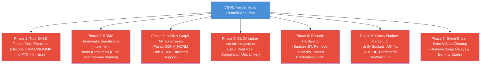

# VGRE Implementation Plan for Gaps, Security, and Cross-Platform Issues

**Last Updated**: 2026-06-07

This document outlines the technical plan and roadmap for resolving the remaining gaps, stubs, mocks, security vulnerabilities, and cross-platform compatibility issues within the VGRE (Virtual GPU Runtime Engine) codebase.

---

## 🗺️ Roadmap Overview



---

## Phase 1: True SASS Tensor Core Emulation (SM80–SM90)

### 1.1 Objective
Replace the comment-only PTX placeholders in `src/compiler/sass/sass_decoder.cpp` for HMMA (`.884`, `.1688`) and WGMMA (SM90) opcodes with fully functional PTX output that invokes the `wmma.mma.sync` or equivalent LLVM intrinsics.

### 1.2 Proposed Changes
- **Parser Update**: Modify the opcode parsing cases in `sass_decoder.cpp` to decode register numbers, layout patterns, and data types (FP16, BF16, TF32).
- **PTX Generation**: Output structured PTX syntax:
  ```ptx
  wmma.mma.sync.aligned.m8n8k4.row.col.f32.f16.f16.f32 %d, %a, %b, %c;
  ```
- **Math Fallback Integration**: Wire the synthetic intrinsics in the translation engine to trigger the multi-threaded CPU tensor core emulation (AVX-512 VNNI / AMX) defined in `tensor_core_emulation.cpp`.

---

## Phase 2: GPUDirect RDMA Queue Pair (QP) Info Exchange

### 2.1 Objective
Implement `sendQPInfo()` and `recvQPInfo()` in `src/advanced/rdma_transport.cpp` to enable end-to-end user-space bypass networking, replacing the immediate `return false` stub with active serialization over `SecureChannel`.

### 2.2 Proposed Changes
- **Data Structuring**: Create a binary packet layout for QP parameters:
  - Local Identifier (LID)
  - Queue Pair Number (QPN)
  - Packet Sequence Number (PSN)
  - Memory Key (rkey)
  - Remote Memory Address (bounce buffer)
- **Serialization**: Write serialization/deserialization helper methods using the existing `SecureChannel` buffer APIs.
- **Connection Handshake**: Wire the serialized exchange into `RDMAConnection::connect()` to transition the local QP states to RTR (Ready to Receive) and RTS (Ready to Send) based on the received remote parameters.

---

## Phase 3: cuDNN Graph API Extensions ✅ Complete

### 3.1 Objective
Implement the fused execution path for `CONV_NORM` fusions and support the RNG descriptor API, removing `CUDNN_STATUS_NOT_SUPPORTED` and sequential fallbacks.

### 3.2 Status — Completed 2026-06-07
- **CONV_NORM Fusion Execution**: `cudnn_executeFusedConvBN()` implemented with two paths — inference folds BN into Conv weights (`W_f=W·γ/σ`, `b_f=β-γμ/σ`), training uses two-pass Conv→mean/var→normalize.
- **RNG Backend**: Philox 4×32 (10 rounds) with uniform, normal (Box-Muller), and Bernoulli distributions. `CUDNN_BACKEND_OPERATION_RNG_DESCRIPTOR` fully functional.

---

## Phase 4: CUDA Linker (cuLink API) Integration

### 4.1 Objective
Transition `cuda_driver_module.cpp` from collecting PTX blobs in-memory to performing actual link-time optimization and PTX compilation unit assembly.

### 4.2 Proposed Changes
- **Linker Assembly**: Parse PTX inputs, resolve `extern __device__` symbol references across compiled PTX blobs, and concatenate variables and kernel declarations.
- **LLVM ORC JIT Binding**: Compile the combined assembly inside `llvm_translation_engine.cpp` as a single logical compilation unit, ensuring cross-module functions map and link correctly before execution.

---

## Phase 5: Security Hardening — Partially Complete

### 5.1 Completed Items
- **Strict Transport Security** ✅ — `packet_handler.cpp` rejects non-handshake packets with `ERR_AUTH_FAILED` when SecureChannel is not yet initialized.
- **PTX Input Sanitization** ✅ — `validateKernelSource()` in `llvm_translation_engine.cpp` blocks syscall opcodes and dangerous function calls before JIT compilation.
- **IPC Shared Memory Permissions** ✅ — `shm_open()` permission changed from `0666` to `0600`.

### 5.2 Remaining
- **Dynamic Cryptographic Salt**: `token_manager_fallback.cpp` still uses hardcoded identity seed — needs per-token random salt stored alongside credentials.
- **Secure Key/Credential Loading**: Environment variable credential reads (`VGRE_TCP_AUTH_TOKEN`) still expose tokens to `ps` output — move to in-memory-only vault reads.

---

## Phase 6: Multi-Platform Compatibility Hardening

### 6.1 Objective
Establish fully unified, equivalent compilation and runtime layers across Windows (MSVC), macOS (Clang), and Linux (GCC/Clang).

### 6.2 Proposed Changes
- **Unified Socket Compatibility Wrapper**:
  - Encapsulate socket APIs under a unified platform interface class (`vgre::common::SocketWrapper`).
  - Standardize error handling by abstracting errors (`getLastSocketError()`) to platform-independent enums.
  - Implement fallback handling for `poll` vs `WSAPoll` on Windows, resolving failure-detection inconsistencies.
- **Unified Thread Affinity Sets**:
  - Implement a uniform processor abstraction layer in `scheduler_numa.cpp`.
  - Resolve Windows core limits by using `SetThreadGroupAffinity` to scale past 64 logical processors.
  - Standardize macOS thread affinity hints and Linux `cpu_set_t` bindings under a single interface.
- **Windows NUMA Allocations**:
  - Replace std/VirtualAlloc calls on Windows inside `memory_manager.cpp` with `VirtualAllocExNuma` matching the Linux NUMA page allocation targets.
- **Cross-Platform IPC Shared Memory**:
  - Implement a dual backend inside `shm_manager.cpp`.
  - Unix: POSIX `shm_open` and `shm_unlink`.
  - Windows: Win32 `CreateFileMappingW` and `MapViewOfFile` prefixed with `Local\vgre_...` namespaces, ensuring correct handle lifecycles.
- **Unified Assembly Barriers & Intrinsics**:
  - Define macro-based thread synchronization barriers inside a common header (`include/vgre/common/cpu_barriers.h`):
    ```cpp
    #if defined(_MSC_VER)
      #define VGRE_CPU_PAUSE() _mm_pause()
      #define VGRE_MEMORY_BARRIER() _ReadWriteBarrier()
    #elif defined(__arm__) || defined(__aarch64__)
      #define VGRE_CPU_PAUSE() asm volatile("yield" ::: "memory")
      #define VGRE_MEMORY_BARRIER() asm volatile("" ::: "memory")
    #else
      #define VGRE_CPU_PAUSE() __builtin_ia32_pause()
      #define VGRE_MEMORY_BARRIER() asm volatile("" ::: "memory")
    #endif
    ```
- **Dynamic Library Loading Abstractions**:
  - Implement a cross-platform wrapper `vgre::common::LibraryLoader` that encapsulates `dlopen`/`dlsym` (Unix) and `LoadLibrary`/`GetProcAddress` (Windows).

---

## Phase 7: Event-Driven Sync and Stub Cleanup

### 7.1 Objective
Eliminate development stubs, mocks, and artificial latency sources in favor of event-driven synchronization and proper pool allocation.

### 7.2 Proposed Changes
- **Remove Sleep/Yield Delays**: Replace artificial polling sleeps and retry loops with condition variables (`std::condition_variable`) or socket-based notifications.
- **CUB Allocator & AST Stub Removal**: Replace the dummy `CachingDeviceAllocator` in `cub_fallback.h` with a functional memory pool allocator linked to the host memory manager.
- **Dynamic Device Attribute Queries**: Replace the hardcoded compute capability (SM 8.6) and hardcoded block limit attributes in `cudart_shim_device_attrs.cpp` with dynamic queries to host hardware capabilities.
