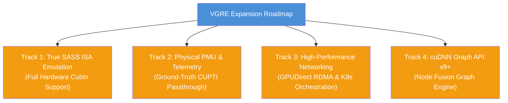
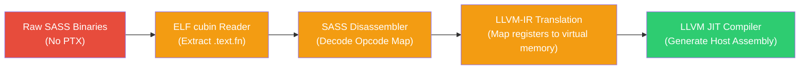

# VGRE Future Implementation Plan

**Version**: 11.0.0  
**Date**: 2026-05-30 (Advanced Mathematical Optimizations Phase)  
**Status**: Forward-Looking Roadmap (For advanced phases beyond the core 191/191 verified baseline)

This document outlines the detailed implementation plans, technical designs, and steps required to resolve the remaining hardware-level gaps, partial implementations, and advanced future enhancements in the VGRE (Virtual GPU Runtime Engine) platform.

---

## 🗺️ Roadmap Overview

The future development of VGRE is organized into **four specialized architectural tracks**:



---

## Track 1: True SASS ISA Emulation (SM80–SM90)

### 1.1 The Issue
VGRE currently extracts high-level PTX from fatbinary containers and JIT-compiles it. If an application utilizes pre-compiled closed-source libraries or obfuscated cubins that lack PTX and only contain SASS (machine instructions compiled for a specific physical GPU architecture), VGRE cannot execute them and returns `CUDA_ERROR_NO_BINARY_FOR_GPU`.

### 1.2 Implementation Plan
To support pure SASS cubins, we will build a user-space **SASS disassembler and interpreter engine** integrated into the LLVM pipeline:



#### Step 1: Cubin ELF Disassembly & Parsing
- Implement a dedicated `CubinELFReader` in `src/compiler/sass/` that parses ELF headers of NVVM cubins.
- Extract the compiled instruction stream from `.text.kernel_name` sections, handling relocation maps (`.rel.text.*`) and constant bank definitions (`.nv.constant0`).

#### Step 2: Instruction Set Architecture (ISA) Map
- Implement a SASS instruction decoder targeting Ampere (SM80) and Hopper (SM90) architectures.
- Map binary opcodes to their symbolic representations (e.g., `IMAD`, `FFMA`, `LDG`, `STS`, `HMMA`, `WGMMA`).
- Define register configurations: 255 general-purpose registers (R0–R254), predicate registers (P0–P7), and uniform registers (UR0–UR63).

#### Step 3: LLVM-IR JIT Translation
- Translate decoded SASS instructions directly into LLVM IR basic blocks:
  - Map registers R0-R254 to a thread-local float/integer array in LLVM.
  - Implement memory operations (`LDG` / `STG`) as memory offsets from the thread-local allocation range base.
  - Translate tensor core instructions (`HMMA`, `WGMMA`) to vectorized host SIMD operations (AVX-512 / Intel AMX intrinsics).

---

## Track 2: Ground-Truth CUPTI Passthrough (Physical PMU)

### 2.1 The Issue
CUPTI performance telemetry is currently software-proxied. While the subscriber and activity APIs work perfectly, they query host CPU hardware PMU counters as a proxy and scale them. They do not query physical GPU performance units directly when VGRE runs in hybrid GPU-enabled worker configurations.

### 2.2 Implementation Plan
Implement a **Dual-Path Telemetry engine** that detects the presence of physical NVIDIA GPUs and binds directly to native CUPTI layers:

```
                  ┌──────────────────────────────┐
                  │ VGRE CUPTI Telemetry Manager │
                  └──────────────┬───────────────┘
                                 │
                     [Detect Hardware Topology]
                                 │
                   ┌─────────────┴─────────────┐
                   │                           │
          [Physical GPU Found]        [No Physical GPU]
                   │                           │
                   ▼                           ▼
      ┌─────────────────────────┐ ┌─────────────────────────┐
      │ Direct CUPTI Dynamic    │ │ Host CPU PMU Proxy      │
      │ Driver Binding via dlopen│ │ (perf_event_open / TSC) │
      └─────────────────────────┘ └─────────────────────────┘
```

#### Step 1: Dynamic Driver Binding
- Enhance `src/api/cupti/cupti_shim.cpp` to check for the presence of physical NVIDIA drivers at startup.
- Dynamically load `libcupti.so` (Linux) or `cupti.dll` (Windows) using `dlopen`/`LoadLibrary`.
- Resolve core subscriber APIs (`cuptiSubscribe`, `cuptiEnableCallback`, `cuptiActivityEnable`) via host-bound function pointers.

#### Step 2: Unified Telemetry Collector
- Implement a telemetry router:
  - If a physical GPU is present, directly register target callbacks with the native CUPTI driver to capture hardware metrics (e.g., cache hit ratios, SM warp latency, DRAM memory throughput).
  - If running in pure CPU emulation mode, fall back to VGRE's standard thread-cycle and memory-throughput proxies.
  - Normalize both data paths into the identical OpenTelemetry (OTLP) JSON/HTTP export format.

---

## Track 3: High-Performance Networking & Orchestration

### 3.1 The Issue
Multi-node VGRE clusters communicate via custom TCP transport with manual host configurations. For large scale environments, manual orchestration of `vgre-worker` nodes and lack of hardware GPUDirect RDMA transport bottlenecks performance.

### 3.2 Implementation Plan
Implement a **Kubernetes Orchestration Operator** and **InfiniBand/RoCE User-Space Bypass** for cluster worker nodes.

#### Step 1: Kubernetes VGRE Operator
- Create a Go-based Kubernetes operator (`vgre-operator`) designed to manage emulated cluster nodes:
  - Define a Custom Resource Definition (CRD) called `VgreCluster`.
  - Automatically spin up a stateful coordinator pod (Master) and dynamically scale daemonset pods (Workers) based on pod request GPU metrics.
  - Automate the generation, secure volume storage, and rotation of HMAC-SHA256 authentication tokens across workers.
  - Configure network policies to map communication on ports `7777` (TCP) and `7778` (UDP) across pod networks.

#### Step 2: GPUDirect RDMA User-Space Bypass
- Enhance the `-DVGRE_ENABLE_RDMA=ON` compilation path:
  - Replace POSIX socket operations with IB Verbs API (`ibv_open_device`, `ibv_alloc_pd`, `ibv_reg_mr`).
  - Implement a zero-copy memory transport that maps emulated device virtual memory ranges (`cudaMalloc` blocks) directly to IB Queue Pairs (QP).
  - Enable remote nodes to read and write directly to worker memory segments via RDMA Write and RDMA Read operations without CPU synchronization interrupts.

---

## Track 4: cuDNN Graph API (v9+)

### 4.1 The Issue
VGRE supports cuDNN v8 backend descriptors (pointwise mode, resample mode, pointwise BWD modes). However, the newer cuDNN v9 Graph API (which allows developers to compile entire mathematical execution graphs containing fusion node blocks) is absent, forcing fallback routines.

### 4.2 Implementation Plan
Implement a **cuDNN Backend Graph Engine** that compiles mathematical execution DAGs into single host CPU JIT execution kernels:

```
cuDNN Graph Definition (Nodes: Conv + ReLU + Add)
                       ↓
      VgreGraphBuilder Parses Node Structure
                       ↓
  Generate Unified LLVM IR (Fused Math Loop Block)
                       ↓
     JIT Compile Fused CPU Kernel Function
                       ↓
Single Parallel Execution Loop (AVX-512 Vector Lanes)
```

#### Step 1: Graph Builder Descriptor Interface
- Implement the core cuDNN v9 backend graph endpoints in `src/api/cudnn/cudnn_graph.cpp`:
  - `cudnnBackendCreateDescriptor(CUDNN_BACKEND_GRAPH_DESCRIPTOR, ...)`
  - `cudnnBackendSetAttribute` for adding operation nodes (`CUDNN_BACKEND_OPERATION_CONVOLUTION_FORWARD_DESCRIPTOR`, `CUDNN_BACKEND_OPERATION_POINTWISE_DESCRIPTOR`).
  - `cudnnBackendFinalize` triggers graph building.

#### Step 2: Loop Fusion & JIT Compilation
- Rather than executing operation nodes sequentially, VGRE's Graph Builder will parse the node topology:
  - Generate a unified LLVM IR representation that merges the mathematical routines of all nodes.
  - Fuse operations (e.g., compiling a Convolution operation directly with its following Pointwise ReLU and Bias Add operations into a single loop).
  - This eliminates intermediate memory writes to host RAM, keeping computed matrices inside CPU L1/L2 cache and SIMD registers.
- Compile the unified fused kernel using the LLVM ORC engine and execute it via the standard `BlockWorkerPool`.
