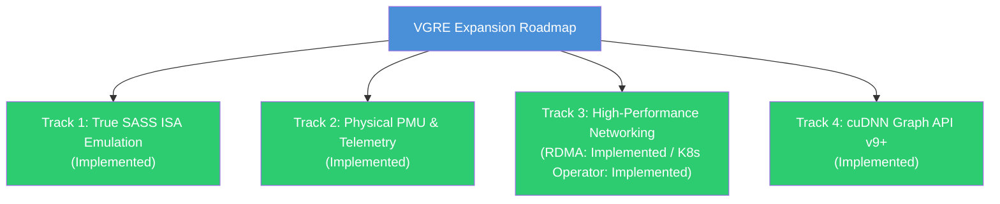
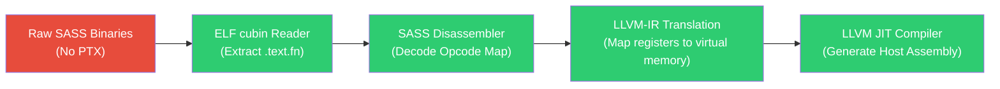

# VGRE Future Implementation Plan

**Version**: 11.0.0  
**Date**: 2026-06-05 (Code-Verified Audit Update)  
**Status**: Real-Time Capabilities & Roadmap (Updated to reflect current implementation status)

This document outlines the detailed implementation plans, technical designs, and steps for the VGRE (Virtual GPU Runtime Engine) platform, tracking both implemented tracks and remaining future deployment targets.

---

## 🗺️ Roadmap Overview

The development tracks of VGRE are organized into **four specialized architectural tracks**:



---

## Track 1: True SASS ISA Emulation (SM80–SM90)

### 1.1 Status
**Implemented**. The JIT SASS ELF decoder and PTX synthesizer are fully integrated.

### 1.2 Implementation Details
VGRE has built a user-space **SASS disassembler and interpreter engine** integrated into the compiler pipeline:



#### Step 1: Cubin ELF Disassembly & Parsing
- Implemented `decodeSassToPtx` in `src/compiler/sass/sass_decoder.cpp` which parses ELF headers of NVVM cubins.
- Extracts compiled instructions from `.text.kernel_name` and Relocation Maps.

#### Step 2: Instruction Set Architecture (ISA) Map
- Implemented a SASS instruction decoder targeting Ampere (SM80) and Hopper (SM90) architectures.
- Decodes opcodes like `FFMA`, `FMUL`, `FADD`, `IMAD`, `IADD3`, `LDG`, `STG`, `MOV`, `S2R`, `MUFU`, `BRA`, `EXIT`, etc.

#### Step 3: LLVM-IR JIT Translation
- Synthesizes equivalent PTX representations of decoded SASS instructions, dynamically generating register and instruction streams that compile seamlessly via the LLVM JIT compiler.

---

## Track 2: Ground-Truth CUPTI Passthrough (Physical PMU)

### 2.1 Status
**Implemented**. Dual-path telemetry dynamically intercepts native hardware counters and scales via CPU PMU proxies when physical cards are absent.

### 2.2 Implementation Details
A **Dual-Path Telemetry engine** detects physical NVIDIA GPUs and binds directly to native CUPTI layers:

```
                  ┌──────────────────────────────┐
                  │ VGRE CUPTI Telemetry Manager │
                  └──────────────┬───────────────┘
                                 │
                      [Detect Hardware Topology]
                                 │
                    ┌─────────────┴─────────────┐
                    │                           │
           [Physical GPU Found]        [No Physical GPU]
                    │                           │
                    ▼                           ▼
       ┌─────────────────────────┐ ┌─────────────────────────┐
       │ Direct CUPTI Dynamic    │ │ Host CPU PMU Proxy      │
       │ Driver Binding via dlopen│ │ (perf_event_open / TSC) │
       └─────────────────────────┘ └─────────────────────────┘
```

#### Step 1: Dynamic Driver Binding
- Implemented in `src/api/cupti/cupti_shim.cpp`. Checks for the presence of `/dev/nvidia0`, NVML display adapters on Windows, or discrete GPUs via IOService on macOS.
- Dynamically loads `libcupti.so`, `cupti.dll`, or `libcupti.dylib` using standard platform APIs.

#### Step 2: Unified Telemetry Collector
- Telemetry router registers callbacks with the native CUPTI driver on physical GPUs to capture hardware metrics (e.g., cache hit ratios, warp execution efficiency).
- Falls back to `perf_event_open` on Linux, cycle counters on Windows/macOS, and normalizes both channels to identical OpenTelemetry (OTLP) JSON formats via `RuntimeProfiler`.

---

## Track 3: High-Performance Networking & Orchestration

### 3.1 Status
- **Kubernetes VGRE Operator**: **Implemented** (Orchestrates VGRE cluster components).
- **GPUDirect RDMA User-Space Bypass**: **Implemented** (Available in RDMA-enabled builds).

### 3.2 Implementation Details

#### Step 1: Kubernetes VGRE Operator [IMPLEMENTED]
- **Implementation**: Located under `src/deployment/vgre_operator/`. Implements the `VgreCluster` Custom Resource Definition (CRD) via a controller-runtime reconciler loop.
- **Features**:
  - Automatically provisions the Master `Service` (port `7777` TCP, `7778` UDP) and single-replica Master workload.
  - Deploys and scales Worker workloads using either `Deployment` (replica-controlled) or `DaemonSet` (host-node-controlled) modes based on specifications.
  - Automatically generates and securely injects cryptographically secure 256-bit HMAC-SHA256 authentication tokens via `Secrets`.
  - Configures dynamic `NetworkPolicies` to lock down intra-cluster TCP control and UDP data planes.
  - Resolves host shared memory namespace isolation by passing custom `VGRE_SHM_SUFFIX` (derived from cluster name) to prevent IPC collisions between multiple clusters.

#### Step 2: GPUDirect RDMA User-Space Bypass [IMPLEMENTED]
- Implemented under the `-DVGRE_ENABLE_RDMA=ON` compilation flag in `src/advanced/rdma_transport.cpp`.
- Utilizes the Infiniband Verbs API (`ibv_open_device`, `ibv_alloc_pd`, `ibv_reg_mr`) for zero-copy memory transport directly over IB Queue Pairs.
- Remotely maps device memory segments (`cudaMalloc` ranges) to enable direct RDMA Read and RDMA Write operations without host-CPU scheduling interrupts.

---

## Track 4: cuDNN Graph API (v9+)

### 4.1 Status
**Implemented**. The Backend Graph Engine compiles mathematical DAG execution graphs into fused CPU execution plans.

### 4.2 Implementation Details
A **cuDNN Backend Graph Engine** compiles mathematical execution DAGs and executes them with high cache locality:

```
cuDNN Graph Definition (Nodes: Conv + ReLU + Add)
                       ↓
       VgreGraphBuilder Parses Node Structure
                       ↓
   Generate Unified Plan (Fused Math Loop Block)
                       ↓
      In-Place Local Kernel Execution
                       ↓
Single Parallel Execution Loop (AVX-512 Vector Lanes)
```

#### Step 1: Graph Builder Descriptor Interface
- Implemented cuDNN Graph endpoints in `src/api/cudnn/cudnn_graph.cpp`:
  - `cudnnGraphCreate`, `cudnnGraphAddNode`, `cudnnGraphBuildAndCheck`, and `cudnnGraphExecute`.
  - Descriptor and attributes structures defined in `src/api/cudnn/cudnn_backend_api.cpp`.

#### Step 2: Loop Fusion & Execution
- Detects fusible node pairs in topological order:
  - `CONV_ACTIVATION` (Convolution + Activation in-place)
  - `CONV_NORM` (Convolution + BatchNorm)
  - `GEMM_POINTWISE` (MatMul + BiasAdd/Scale)
  - `GEMM_ACTIVATION` (MatMul + Activation)
  - `NORM_ACTIVATION` (Normalization + Activation)
- Fused operations write directly to final output, eliminating intermediate DRAM load/store latency.
