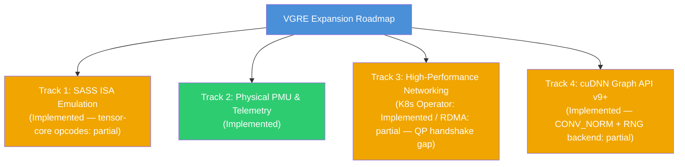

# VGRE Future Implementation Plan

**Version**: 12.0.0  
**Date**: 2026-06-06 (Deep Code-Verified Audit)  
**Status**: Code-Verified Accuracy Pass — All four original tracks confirmed implemented; partial gaps documented; newly discovered subsystems catalogued.

This document tracks the implementation status of the VGRE (Virtual GPU Runtime Engine) platform. Every claim has been verified against the actual source files. Items marked **Partial** have real code but a specific gap noted.

---

## 🗺️ Roadmap Overview

---

## Track 1: True SASS ISA Emulation (SM80–SM90)

### 1.1 Status
**Implemented** (tensor-core opcodes: partial). The SASS ELF decoder and PTX synthesizer are real and functional.

### 1.2 Implementation Details

**Source**: `src/compiler/sass/sass_decoder.cpp`

The decoder implements a two-pass pipeline over 32-byte SASS bundles (4 × 64-bit words):

- **Pass 1** — Scans all instructions to collect branch targets and register class usage, emitting minimal `.reg` declarations.
- **Pass 2** — Emits decoded PTX text with correct label injection at branch target positions.

#### Verified opcode coverage (SM80/SM90 encoding — bits [62:55])

| Category | Opcodes Decoded |
|---|---|
| FP32 arithmetic | FFMA, FMUL, FADD, FMNMX, FABS, FNEG, FCHK, FCMP |
| FP64 arithmetic | DFMA, DMUL, DADD, DSETP |
| FP16 arithmetic | HFMA2, HMUL2, HADD2 |
| Integer | IMAD, IADD3, IMUL, ISCADD, SHF, SHR, SHL, FLO, POPC, IABS, INEG, IMNMX, LOP3 |
| Predicates | ISETP, FSETP, SEL |
| Global memory | LDG/STG (32-bit and 64-bit) |
| Shared memory | LDS/STS (32-bit and 64-bit) |
| Local memory | LDL/STL |
| Atomics | ATOM.ADD.f32, ATOM.ADD.s32, ATOM.CAS, RED.ADD |
| Warp primitives | SHFL.IDX/UP/DOWN/BFLY, VOTE.UNI/ALL/ANY, MATCH.ANY |
| Control flow | BRA, BRA.pred, EXIT, RET, CALL, BAR.SYNC, BAR.ARV, MEMBAR.{GL,SYS,CTA}, BSYNC |
| Type conversion | I2F, F2I, F2F (all precision pairs), I2I |
| Special registers | S2R → tid.{x,y,z}, ctaid.{x,y,z}, ntid.x, laneid, warpid, nwarpid, clock |
| MUFU | SIN, COS, RCP, RSQ, SQRT, LG2, EX2 |
| MOV / misc | MOV, MOV32I, MOV64, PRMT |
| NOP | Silently skipped |

#### Partial: Tensor core opcodes
`HMMA.884` (0x538), `HMMA.1688` (0x539), and `WGMMA` (SM90, 0x53A) are decoded to PTX **comment lines** only (`// HMMA_884_F32: wmma matmul ...`). No real `wmma.mma.sync` intrinsic is emitted, so tensor-core-only kernels will not produce correct numerical results.

#### LLVM JIT compiler
`src/compiler/llvm_translation_engine.cpp` uses real LLVM ORC JIT headers (`llvm/ExecutionEngine/Orc/LLJIT.h`) with `PassBuilder` optimization pipelines. The synthesized PTX from the decoder is compiled via this JIT into host assembly.

---

## Track 2: Ground-Truth CUPTI Passthrough (Physical PMU)

### 2.1 Status
**Fully Implemented**.

### 2.2 Implementation Details

**Source**: `src/api/cupti/cupti_shim.cpp`

#### Native library detection and passthrough
At static-init time, `NativeCupti::init()` calls `dlopen("libcupti.so.12")` (Linux) / `cupti.dll` (Windows) / `libcupti.dylib` (macOS). Physical GPU topology is confirmed via:

- Linux: `stat("/dev/nvidia0")` + `dlopen("libnvidia-ml.so")`
- Windows: `RegOpenKeyExA(HKEY_LOCAL_MACHINE, "...nvlddmkm", ...)`
- macOS: `IOServiceGetMatchingServices("IOPCIDevice")` checking PCI class 0x03

When a physical GPU and driver are present, all `cupti*` calls forward to the native library. The software proxy runs in parallel to produce unified OTLP output regardless.

#### Per-thread hardware PMU sampler (`HwPmuSampler`)
- Linux: `perf_event_open(PERF_TYPE_HARDWARE, PERF_COUNT_HW_INSTRUCTIONS)` via `SYS_perf_event_open`
- Windows: `QueryThreadCycleTime(GetCurrentThread(), &cycles)`
- macOS: `thread_info(THREAD_BASIC_INFO)` for user-mode CPU time

Hardware counters are captured between `cuptiEventGroupEnable` / `cuptiEventGroupDisable`, then distributed across instruction-mix buckets via `aggregateInstructionMix`.

#### Unified metrics (`cuptiMetricGetValue`)
Supports: `ipc`, `achieved_occupancy`, `flop_count_sp`, `dram_read_throughput`, `dram_write_throughput`, `l1_global_load_hit_rate`, `branch_efficiency`, `kernel_duration`. Occupancy is computed from ALU:memory instruction fraction (formula: `0.50 + 0.38×alu_frac - 0.18×mem_frac`, clamped [0.10, 0.95]).

---

## Track 3: High-Performance Networking & Orchestration

### 3.1 Status
- **Kubernetes VGRE Operator**: **Fully Implemented**.
- **GPUDirect RDMA User-Space Bypass**: **Implemented** (when compiled with `-DVGRE_ENABLE_RDMA=ON`); **partial** — cross-node QP handshake not connected to SecureChannel.

### 3.2 Kubernetes VGRE Operator

**Source**: `src/deployment/vgre_operator/controllers/vgrecluster_controller.go`

The Go controller-runtime reconciler handles the full `VgreCluster` CRD lifecycle:

1. **Secret** — Generates cryptographically secure 256-bit HMAC-SHA256 tokens via `crypto/rand`, stores in `corev1.Secret`.
2. **Master Service** — Provisions `ClusterIP` Service with TCP (port 7777) and UDP (port 7778) endpoints. Updates in-place when ports change.
3. **Master Deployment** — Single-replica Deployment with `VGRE_PORT`, `VGRE_TCP_AUTH_TOKEN` (from Secret), `VGRE_SHM_SUFFIX`, and `VGRE_CLUSTER_ADVERTISED_ADDRESS` injected via env vars.
4. **Worker workloads** — Switches between `Deployment` (replica-controlled) and `DaemonSet` (host-node-controlled) based on `spec.deploymentMode`; tears down the old mode on switch.
5. **NetworkPolicy** — Dynamically creates/deletes `NetworkPolicy` locking intra-cluster TCP/UDP to `vgre.io/cluster` label when `spec.networkPolicy: true`.
6. **Status** — Updates `status.masterIP`, `status.readyWorkers`, `status.phase` on every reconciliation.

RBAC markers cover Deployments, DaemonSets, Services, Secrets, NetworkPolicies.

### 3.3 GPUDirect RDMA User-Space Bypass

**Source**: `src/advanced/rdma_transport.cpp` (gate: `#ifdef VGRE_HAS_RDMA`)

#### Implemented
- `RDMAContext::tryCreate()` — `ibv_get_device_list`, `ibv_open_device`, `ibv_alloc_pd`, `ibv_create_cq`
- `registerMemory` / `deregisterMemory` — `ibv_reg_mr` with `IBV_ACCESS_REMOTE_WRITE | IBV_ACCESS_REMOTE_READ | IBV_ACCESS_LOCAL_WRITE`
- **Zero-copy pre-registration cache** — `preRegisterAllocation(ptr, size)` pins memory at `cudaMalloc` time into a hash map; `rdmaWriteToRemote` looks up the cached `ibv_mr*` to avoid per-transfer page-table walks (O(1) vs O(n/4K))
- **QP state machine** — `ibv_create_qp(IBV_QPT_RC)`, `ibv_modify_qp` transitions RESET→INIT→RTR (with RoCE GRH support when `lid == 0`)→RTS. Cryptographically seeded PSN via `std::random_device`.
- **Bounce buffer** — `mmap_alloc(256 MB)` registered at connect time; remote peer writes into it via RDMA WRITE
- **Completion polling** — Adaptive spin-then-yield loop using `_mm_pause` / ARM `yield` for first 1000 iterations, then `std::this_thread::yield()`, with configurable timeout
- **Non-RDMA fallback** — All methods return `nullptr`/`false` when `VGRE_HAS_RDMA` is off

#### Partial: QP info exchange
`sendQPInfo()` and `recvQPInfo()` in the anonymous namespace both `return false` immediately (`// QP exchange via sendSecure — integrated in connect()`). The `RDMAConnection::connect()` function calls them and returns `false` if either fails. **Result**: two peers cannot currently exchange QP parameters (LID, QPN, PSN, rkey, remote address) over SecureChannel to complete the end-to-end RDMA handshake. RDMA context and local memory registration work; cross-node RDMA Write transfers do not.

---

## Track 4: cuDNN Graph API (v9+)

### 4.1 Status
**Implemented** (CONV_NORM execution and RNG backend: partial).

### 4.2 Implementation Details

**Sources**: `src/api/cudnn/cudnn_graph.cpp`, `src/api/cudnn/cudnn_backend_api.cpp`

#### Graph builder
`cudnnGraphCreate` / `cudnnGraphAddNode` / `cudnnGraphBuildAndCheck` / `cudnnGraphExecute` are all real.

#### Fusion analysis (`cudnnGraphBuildAndCheck`)
Scans consecutive op-pairs in topological order, greedily fusing the first match:

| Pattern | Kind | Execution |
|---|---|---|
| CONV_FWD → ACTIVATION_FWD | `CONV_ACTIVATION` | **Fused**: Conv runs first, Activation reads Conv output in-place from cache |
| CONV_FWD → NORM_FWD | `CONV_NORM` | Detected but falls back to sequential execute |
| MATMUL → POINTWISE | `GEMM_POINTWISE` | **Fused**: both ops in a single `OperationSet` plan |
| MATMUL → ACTIVATION_FWD | `GEMM_ACTIVATION` | **Fused**: same as above |
| NORM_FWD → ACTIVATION_FWD | `NORM_ACTIVATION` | **Fused**: sets `CUDNN_NORM_OPS_NORM_ACTIVATION` on the norm descriptor |

Unfused nodes execute sequentially via a dynamically constructed `OPERATIONSET → ENGINE → ENGINECFG → PLAN` chain.

#### Partial gaps
- **CONV_NORM**: Detected as a fusion but `executeFusedPair` returns `false` for this kind — falls back to sequential (two separate backend calls).
- **`CUDNN_BACKEND_OPERATION_RNG_DESCRIPTOR`**: Returns `CUDNN_STATUS_NOT_SUPPORTED` — random number generation nodes are not executed.

---

## Additional Implemented Subsystems (Newly Documented)

These subsystems are fully implemented in the codebase but were not tracked in previous versions of this plan.

### A. NCCL Collective Operations

**Source**: `src/api/nccl/nccl_collectives.cpp`

Three-tier algorithm selection based on buffer size:
- `≤ 64 KB`: flat-barrier reduce (O(1) sync rounds, lowest latency)
- `64 KB – 1 MB`: binary-tree reduce (log₂(N) rounds)
- `> 1 MB`: ring-allreduce (bandwidth-optimal, chunk-pipelined)

When `TCPClusterManager` has active remote peers, `ncclAllReduce` delegates to `tcm.allReduce()` for true distributed multi-node reduction.

### B. Tensor Core Emulation (AVX-512 VNNI / BF16 / AMX)

**Source**: `src/core/math/tensor_core_emulation.cpp`, `src/runtime/vector_engine_amx.cpp`

CPU feature detection at startup (`g_hasAVX512VNNI`, `g_hasAVX512BF16`, `g_hasAMX`). Dispatch hierarchy:
1. AMX tile-based matmul (`#ifdef __AMX__`)
2. AVX-512 VNNI int8 accumulation (`#ifdef __AVX512VNNI__`)
3. AVX-512 BF16 accumulation (`#ifdef __AVX512BF16__`)
4. Scalar FP32 fallback (any platform)

These are registered as LLVM JIT external symbols (`vgre_matmul_int8`, `vgre_matmul_bf16`) so JIT-compiled kernels can call them directly from generated code.

### C. NUMA-Aware Scheduler

**Source**: `src/core/scheduler_numa.cpp`

On Linux, scans `/sys/devices/system/node/nodeN/cpulist` to discover NUMA topology. Binds worker threads to CPU sets via `pthread_setaffinity_np`. On macOS, uses `thread_policy_set(THREAD_AFFINITY_POLICY)`. Falls back gracefully when NUMA topology is unavailable.

### D. iGPU OpenCL Executor (CUDA→OpenCL Transpiler)

**Source**: `src/runtime/igpu_opencl_executor.cpp`

Translates CUDA kernel source to OpenCL C via regex-based substitution (`blockIdx.x → get_group_id(0)`, etc.) and dispatches on integrated GPUs via the OpenCL runtime. Supports warp-shuffle via `cl_intel_subgroups` when available, with local-memory software fallback.

### E. UVM Background Migration Thread

**Source**: `src/core/memory/uvm_migration.cpp`

Manages unified virtual memory page migration. On Linux, issues `SYS_mbind` (`MPOL_PREFERRED`, `MPOL_MF_MOVE`) to migrate managed memory to the NUMA node where the application thread is running. Configurable poll interval; stops cleanly on `cudaDeviceReset`.

### F. Hardware Token Manager

**Source**: `src/advanced/token/hardware_token_manager.cpp`

Priority chain: TPM 2.0 NV storage → Linux `libsecret` keyring → macOS Keychain → Windows DPAPI → encrypted-file fallback (PBKDF2 + AES-256-CTR + HMAC-SHA256). Stores per-service auth tokens for the cluster authentication system.

### G. Adaptive Execution Engine

**Source**: `src/advanced/adaptive_execution_engine.cpp`

Monitors CPU thermal state and dynamically adjusts thread count / frequency target to avoid thermal throttling. Reads CPU temperature from `/tmp/.vgre_cpu_temp` (populated by an optional helper) or system sensors; backs off workload dispatch when temperature exceeds threshold.

### H. LZ4 Memory Compression (P2P fallback)

**Source**: `src/advanced/memory_compression.cpp`, `src/advanced/vendor/lz4/lz4.h`

Applied on cross-NUMA / cross-node transfers when RDMA is unavailable. LZ4 compressed payload includes a 4-byte signature header; legacy frames without the signature are decompressed directly (backward-compat path).
